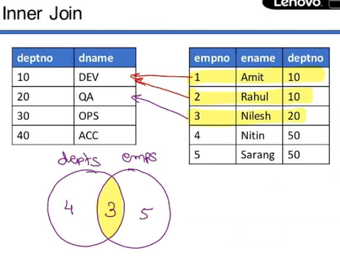

# ENTITY RELATIONs

##### NORMALIZATIOn : how to create this tables and relations between them
- but first we need to learn for how to acceas data from multiple tables
- for that we have joins

# JOINS
- select data from data from multiple tables using single query.
- joins are only in SELECT query DQL.
* Cross join
* Inner join
* Left Outer Join
* full Outer Join
* Self Join


DROP TABLE IF EXISTS depts;

DROP TABLE IF EXISTS emps;

DROP TABLE IF EXISTS addr;

DROP TABLE IF EXISTS meeting; 
DROP TABLE IF EXISTS emp_meeting;

CREATE TABLE depts (deptno INT, dname VARCHAR(20));

INSERT INTO depts VALUES (10, 'DEV');

INSERT INTO

depts

VALUES

(20, 'QA' );

INSERT

INTO

depts

VALUES

(30, 'OPS' );

INSERT

INTO

depts

VALUES

(40, 'ACC');

CREATE TABLE emps (empno INT, ename VARCHAR (20), deptno INT, mgr

INT);

INSERT

INTO

emps

VALUES

(1, 'Amit', 10, 4);

INSERT

INTO

emps

VALUES 

(2, 'Nilesh', 20, 4);
INSERT

INTO

emps

VALUES ( 3, 'Nitin' , 50 , 5) ;

INSERT INTO emps INSERT

INTO

emps

VALUES (4,

'Nitin', 50, 5);

INSERT

INTO

emps

VALUES

(5, 'Sarang', 50, NULL);


CREATE

TABLE

addr(empno

INT,

tal VARCHAR(20), dist VARCHAR(20));

INSERT

INTO

addr VALUES 

(1, 'Gad', 'Kolhapur'); 

INSERT INTO addr

VALUES
(2, 'Karad', 'Satara');

INSERT INTO

addr

VALUES

(3, 'Junnar', 'Pune');

INSERT

INTO

addr

VALUES

(4, 'Wai', 'Satara');

INSERT INTO addr VALUES (5, 'Karad', 'Satara');


CREATE

TABLE

meeting (meetno

INT, topic VARCHAR(20), venue VARCHAR(20));

INSERT

INTO

meeting VALUES

(100, 'Scheduling', 'Director Cabin');

INSERT

INTO

meeting

VALUES

(200, 'Annual meet', 'Board Room');

INSERT

INTO meeting VALUES

(300, 'App Design', 'Co-director Cabin');

CREATE

TABLE emp_meeting (meetno INT, empno INT);

INSERT

INTO

emp_meeting

VALUES

(100,

3);

INSERT INSERT

INTO

emp_meeting

VALUES VALUES

(100,

4);

INTO INTO

emp_meeting

(200, (200,

1); 2);

INSERT

emp_meeting emp_meeting

VALUES

INSERT

INTO

VALUES

(200,

3);

INSERT

INTO

emp_meeting

VALUES

(200,

4);

INSERT

INTO emp_meeting

VALUES

(200,

5);

INSERT

INTO emp_meeting

VALUES

(300,

1);

INSERT

INTO emp_meeting

VALUES

(300,

2);

INSERT

INTO emp_meeting

VALUES

(300,

4);
```
## CROSS JOIN

```SQL
mysql> SELECT * from depts ;
+--------+-------+
| deptno | dname |
+--------+-------+
|     10 | DEV   |
|     20 | QA    |
|     30 | OPS   |
|     40 | ACC   |
+--------+-------+

mysql> SELECt * from emps;
+-------+--------+--------+------+
| empno | ename  | deptno | mgr  |
+-------+--------+--------+------+
|     1 | Amit   |     10 |    4 |
|     2 | Rahul  |     10 |    3 |
|     3 | Nilesh |     20 |    4 |
|     4 | Nitin  |     50 |    5 |
|     5 | Sarang |     50 | NULL |
+-------+--------+--------+------+
```
- find all possible department in an employee can be

- how to do this in rdbms
- we can take help of joins.
```SQL
SELECT enanme , dname FROM emps CROSS JOIN depts ;
```

```SQL
mysql> SELECT ename , dname from emps CROSS JOIN depts ;
+--------+-------+
| ename  | dname |
+--------+-------+
| Amit   | ACC   |
| Amit   | OPS   |
| Amit   | QA    |
| Amit   | DEV   |
| Rahul  | ACC   |
| Rahul  | OPS   |
| Rahul  | QA    |
| Rahul  | DEV   |
| Nilesh | ACC   |
| Nilesh | OPS   |
| Nilesh | QA    |
| Nilesh | DEV   |
| Nitin  | ACC   |
| Nitin  | OPS   |
| Nitin  | QA    |
| Nitin  | DEV   |
| Sarang | ACC   |
| Sarang | OPS   |
| Sarang | QA    |
| Sarang | DEV   |
+--------+-------+
-- same as we can do this  in programming , this fetch
```
- if columns have same name 
- then 
```SQL
mysql> SELECT emps.ename , depts.dname from emps CROSS JOIN depts ;
-- if both table have same column name
-- to avoid conficts
-- we need to specify the table name 
-- recommends this
-- we can make alias to table name while selecting columns

mysql> SELECT e.ename , d.dname from emps as e CROSS JOIN depts as d ;
mysql> SELECT e.ename , d.dname from emps  e CROSS JOIN depts  d ;

```

- suppose we revers the order of joins will it give the same results
- no of results will be same bcoz 5*4 and 4*5 is same
- output will depeds on order of columns printing
```SQL
mysql> SELECT e.ename , d.dname from depts d CROSS JOIN emps e  ;
+--------+-------+
| ename  | dname |
+--------+-------+
| Amit   | ACC   |
| Amit   | OPS   |
| Amit   | QA    |
| Amit   | DEV   |
| Rahul  | ACC   |
| Rahul  | OPS   |
| Rahul  | QA    |
| Rahul  | DEV   |
| Nilesh | ACC   |
| Nilesh | OPS   |
| Nilesh | QA    |
| Nilesh | DEV   |
| Nitin  | ACC   |
| Nitin  | OPS   |
| Nitin  | QA    |
| Nitin  | DEV   |
| Sarang | ACC   |
| Sarang | OPS   |
| Sarang | QA    |
| Sarang | DEV   |
+--------+-------+
```
- outer loop --> driving loop/Table
- inner loop --> driven loop/Table
- in MYSQL --> larger table --> Driving Table
           --> smaller table --> Driven Table
- CROSS JOIN is fastest join bcoz there is no condition
 
 # INNER JOIN

 - fetch ename and department name of that employee is now
 - again need to use loop inside loop 
 - outer loop will be on emps and inner loop will be on depts
 - but to fetch current dept name need to apply a condition
 - if e.deptno == d.deptno --> if true 
 - then we must print only that dname
 
 - now 5 records from emps and 4 records from depts
 - but output will be 5*1 --> 5 bcoz a employee can can one dept only
 ```SQL
 mysql> SELECT e.ename , d.dname from emps e CROSS JOIN depts d where e.deptno=d.deptno ;
+--------+-------+
| ename  | dname |
+--------+-------+
| Amit   | DEV   |
| Rahul  | DEV   |
| Nilesh | QA    |
+--------+-------+

-- Nitin and Sarang has deptno 50 which is not present in depts Table

--- with INNER JOIN
mysql> SELECT e.ename , d.dname from emps e INNER JOIN depts d ON e.deptno = d.deptno ;
+--------+-------+
| ename  | dname |
+--------+-------+
| Amit   | DEV   |
| Rahul  | DEV   |
| Nilesh | QA    |
+--------+-------+
 ```
 - Inner join fetch common data from both table 
 - Inner join associte with some codition with ON keyword.
 - if no condition is given all combitions will fetched like cross join
 - apply condition on which is common in both table
 -
 

 # LEFT OUTER JOIN
- result --> intersection and extra records from left
 - print all from emps with ename , dname , 
 - if employee doesn't have dname then print null 
 - we need to print common data as well as other data from emps 
 ```SQL
 foreach e in  emps 
 {  flag = true ;
    foreach d in deptd 
    {
        if( e.deptno == d.deptno ){
            flag = false ;
            print( e.ename , d.dname);
        }
    }

    if( flag ){
        print( e.naem , null ) ;
    }
 }
 -- this is sudo code 
 ```
```SQL
SELECT e.ename , d.dname from emps e LEFT OUTER JOIN depts d ON e.deptno = d.deptno;
+--------+-------+
| ename  | dname |
+--------+-------+
| Amit   | DEV   |
| Rahul  | DEV   |
| Nilesh | QA    |
| Nitin  | NULL  |
| Sarang | NULL  |
+--------+-------+

-- left --> emps (left of JOIN keyword)

```

- here outer keyworg is optional
- every time we write left join it always the outer
# Right outer join
- result --> intersection and extra records from right
- same result can be achieved by changing order of left and right tables
```SQL
-- using left join but we need to change which one is left or right
mysql> SELECT d.dname , e.ename from depts d LEFT JOIN emps e ON e.deptno=d.deptno ;
+-------+--------+
| dname | ename  |
+-------+--------+
| DEV   | Rahul  |
| DEV   | Amit   |
| QA    | Nilesh |
| OPS   | NULL   |
| ACC   | NULL   |
+-------+--------+

-- using right outer join
mysql> SELECT d.dname , e.ename from emps e RIGHT JOIN depts d ON e.deptno=d.deptno ;
+-------+--------+
| dname | ename  |
+-------+--------+
| DEV   | Rahul  |
| DEV   | Amit   |
| QA    | Nilesh |
| OPS   | NULL   |
| ACC   | NULL   |
+-------+--------+

```


# FULL OUTER JOIN

- now I want intersecton + all extra from left and all extra from right

```SQl
mysql> SELECT e.ename , d.dname from emps e Full Join depts d ON e.deptno=d.deptno ;
-- error not supported in mySQL RDBMS
-- can be possible by set operator concept
```


## SET OPERATORS
- simulaton of full join 
```SQL
-- left join
SELECT e.ename , d.dname from emps e LEFT JOIN depts d ON e.deptno=d.deptno ;
-- right join
SELECT e.ename , d.dname from emps e RIGHT JOIN depts d ON e.deptno=d.deptno ;

-- here intersection is common in both ,
-- the data which is common in both left and right join is intersection part 
-- to achive full join we need that intersection , but only once
-- for that we use UNION
-- (left join) UNION (right join) ;

(SELECT e.ename , d.dname from emps e LEFT JOIN depts d ON e.deptno=d.deptno) 
UNION 
(SELECT e.ename , d.dname from emps e RIGHT JOIN depts d ON e.deptno=d.deptno) ;
+--------+-------+
| ename  | dname |
+--------+-------+
| Amit   | DEV   |
| Rahul  | DEV   |
| Nilesh | QA    |
| Nitin  | NULL  |
| Sarang | NULL  |
| NULL   | OPS   |
| NULL   | ACC   |
+--------+-------+


-- if you want to just add right join to left join without eliminating extra common part
-- use UNION ALL

(SELECT e.ename , d.dname from emps e LEFT JOIN depts d ON e.deptno=d.deptno) 
UNION ALL
(SELECT e.ename , d.dname from emps e RIGHT JOIN depts d ON e.deptno=d.deptno) ;
+--------+-------+
| ename  | dname |
+--------+-------+
| Amit   | DEV   |
| Rahul  | DEV   |
| Nilesh | QA    |
| Nitin  | NULL  |
| Sarang | NULL  |
| Rahul  | DEV   |
| Amit   | DEV   |
| Nilesh | QA    |
| NULL   | OPS   |
| NULL   | ACC   |
```


# SLEF JOIN


- req --> which emp is reporting to which emp
- 
- we have only one table 
- need to 
- join table to itself

- let first understands using two table
- emps and mrg --> both have same records
```SQL
-- table emps and mrgs have same data
+-------+--------+--------+------+
| empno | ename  | deptno | mgr  |
+-------+--------+--------+------+
|     1 | Amit   |     10 |    4 |
|     2 | Rahul  |     10 |    3 |
|     3 | Nilesh |     20 |    4 |
|     4 | Nitin  |     50 |    5 |
|     5 | Sarang |     50 | NULL |
+-------+--------+--------+------+
SELECT e.ename , m.ename from emps e 
INNER JOIN mrgs m ON e.mgr = m.empno ;

-- but we have only one table
SELECT e.ename as employee , m.ename as manager from emps e 
INNER JOIN emps m ON e.mgr = m.empno ;

+----------+---------+
| employee | manager |
+----------+---------+
| Rahul    | Nilesh  |
| Nilesh   | Nitin   |
| Amit     | Nitin   |
| Nitin    | Sarang  |
+----------+---------+
```
- here there is no manager to sarang
- that's why sarang is eliminated

- if we want to add sarang
- like we did in left outer join
```SQl
-- self join --> outer join -- > intersection + extra from left side
SELECT e.ename as employee , m.ename as manager from emps e 
LEFT OUTER JOIN emps m ON e.mgr = m.empno ;
+----------+---------+
| employee | manager |
+----------+---------+
| Amit     | Nitin   |
| Rahul    | Nilesh  |
| Nilesh   | Nitin   |
| Nitin    | Sarang  |
| Sarang   | NULL    |
+----------+---------+
```
```SQl
foreach e in emps {
    foreach m in mrgs{
        if( e.mgr == m.empno ){
            print( e.ename , m.ename );
        }
    }
}

-- like selection sort in DSA 

```

# JOINS With Clauses
