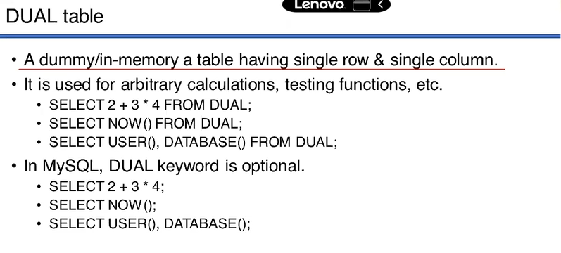

## DUAL TABLE


- single row column
- first used in oracle --> two rows and two column
- later it changed to single 
- but they didn't changed its name
- used for calculations , testing functions
- when we want to calculations from server 

```SQL

mysql> SELECT 6*3+2 from DUAL;
+-------+
| 6*3+2 |
+-------+
|    20 |
+-------+
1 row in set (0.00 sec)

-- in MySQL --> DUAL is optional
mysql> SELECT 6*3+2 ;
+-------+
| 6*3+2 |
+-------+
|    20 |
+-------+
1 row in set (0.00 sec)
```
```SQL
-- information functions
-- NOW()  --> current server time
mysql> SELECT NOW();
+---------------------+
| NOW()               |
+---------------------+
| 2023-11-11 10:08:11 |
+---------------------+
1 row in set (0.00 sec)


mysql> SELECT SYSDATE() FROM DUAL;
+---------------------+
| SYSDATE()           |
+---------------------+
| 2023-11-11 10:13:33 |
+---------------------+

```
```SQL
-- version function
mysql> SELECT VERSION() FROM DUAL;
+-----------+
| VERSION() |
+-----------+
| 8.0.35    |
```
```SQL

mysql> SELECT USER() , DATABASE() ;
+-----------------+------------+
| USER()          | DATABASE() |
+-----------------+------------+
| flash@localhost | cdacdb     |
+-----------------+------------+
```
- we can also use FROM DUAL keyword
-
- 
- ANSI optional Keywords : AS, ASC , DESC 
# MYSQL FUNCTIONS
* used to perform some operations on table data.
* Can also be used without any table data with aribitrary values with optional DUAL table.  

## STRING FUNCTION
*   ASCII FUNCTION
```SQL
/*
-- ASCII --> American Standard Code for Infromation Interchange
mysql> HELP ASCII;
Name: 'ASCII'
Description:
Syntax:
ASCII(str)

Returns the numeric value of the leftmost character of the string str.
Returns 0 if str is the empty string. Returns NULL if str is NULL.
ASCII() works for 8-bit characters.

URL: https://dev.mysql.com/doc/refman/8.0/en/string-functions.html

Examples:
mysql> SELECT ASCII('2');
        -> 50
mysql> SELECT ASCII(2);
        -> 50
mysql> SELECT ASCII('dx');
        -> 100
```
```SQL
-- char to ASCII
mysql> SELECT ascii('5');
+------------+
| ascii('5') |
+------------+
|         53 |
+------------+
1 row in set (0.00 sec)

mysql> SELECT ASCII('HELLO');
+----------------+
| ASCII('HELLO') |
+----------------+
|             72 |
+----------------+
1 row in set (0.00 sec)

mysql> SELECT ASCII('H');
+------------+
| ASCII('H') |
+------------+
|         72 |
+------------+
1 row in set (0.00 sec)

mysql> SELECT ASCII(' ');
+------------+
| ASCII(' ') |
+------------+
|         32 |
+------------+
1 row in set (0.00 sec)

mysql> SELECT ASCII('10');
+-------------+
| ASCII('10') |
+-------------+
|          49 |
+-------------+
1 row in set (0.00 sec)
```

```SQL
-- char to ASCII
/*
mysql>  HELP Char Function;
Name: 'CHAR FUNCTION'
Description:
Syntax:
CHAR(N,... [USING charset_name])

CHAR() interprets each argument N as an integer and returns a string
consisting of the characters given by the code values of those
integers. NULL values are skipped.

By default, CHAR() returns a binary string. To produce a string in a
given character set, use the optional USING clause:

mysql> SELECT CHAR(77,121,83,81,'76' USING utf8mb4);
+---------------------------------------+
| CHAR(77,121,83,81,'76' USING utf8mb4) |
+---------------------------------------+
| MySQL                                 |
+---------------------------------------+
1 row in set (0.00 sec)

mysql> SELECT CHAR(77,77.3,'77.3' USING utf8mb4);
+------------------------------------+
| CHAR(77,77.3,'77.3' USING utf8mb4) |
+------------------------------------+
| MMM                                |
+------------------------------------+
1 row in set, 1 warning (0.00 sec)

mysql> SHOW WARNINGS;
+---------+------+-------------------------------------------+
| Level   | Code | Message                                   |
+---------+------+-------------------------------------------+
| Warning | 1292 | Truncated incorrect INTEGER value: '77.3' |
+---------+------+-------------------------------------------+
1 row in set (0.00 sec)

If USING is given and the result string is illegal for the given
character set, a warning is issued. Also, if strict SQL mode is
enabled, the result from CHAR() becomes NULL.

If CHAR() is invoked from within the mysql client, binary strings
display using hexadecimal notation, depending on the value of the
--binary-as-hex. For more information about that option, see
https://dev.mysql.com/doc/refman/8.0/en/mysql.html.

CHAR() arguments larger than 255 are converted into multiple result
bytes. For example, CHAR(256) is equivalent to CHAR(1,0), and
CHAR(256*256) is equivalent to CHAR(1,0,0):

mysql> SELECT HEX(CHAR(1,0)), HEX(CHAR(256));
+----------------+----------------+
| HEX(CHAR(1,0)) | HEX(CHAR(256)) |
+----------------+----------------+
| 0100           | 0100           |
+----------------+----------------+
1 row in set (0.00 sec)

mysql> SELECT HEX(CHAR(1,0,0)), HEX(CHAR(256*256));
+------------------+--------------------+
| HEX(CHAR(1,0,0)) | HEX(CHAR(256*256)) |
+------------------+--------------------+
| 010000           | 010000             |
+------------------+--------------------+
1 row in set (0.00 sec)

URL: https://dev.mysql.com/doc/refman/8.0/en/string-functions.html

Examples:
mysql> SELECT CHAR(77,121,83,81,'76');
+--------------------------------------------------+
| CHAR(77,121,83,81,'76')                          |
+--------------------------------------------------+
| 0x4D7953514C                                     |
+--------------------------------------------------+
1 row in set (0.00 sec)

mysql> SELECT CHAR(77,77.3,'77.3');
+--------------------------------------------+
| CHAR(77,77.3,'77.3')                       |
+--------------------------------------------+
| 0x4D4D4D                                   |
+--------------------------------------------+
1 row in set (0.00 sec) */
```
- on windows results is in hex form 
- but on linux and mac devices it will show in ASCII
- we need to use USING keyword
```SQL
mysql> SELECT CHAR(65 USING ASCII);
+----------------------+
| CHAR(65 USING ASCII) |
+----------------------+
| A                    |
+----------------------+
1 row in set (0.00 sec)

mysql> SELECT CHAR(77,121,83,81,'76' USING ASCII);
+-------------------------------------+
| CHAR(77,121,83,81,'76' USING ASCII) |
+-------------------------------------+
| MySQL                               |
+-------------------------------------+
1 row in set (0.00 sec)
```
### STRING LENGTH
```SQL
mysql> SELECT LENGTH('SHRIKANT');
+--------------------+
| LENGTH('SHRIKANT') |
+--------------------+
|                  8 |
+--------------------+

mysql> SELECT LENGTH('HELLO WORLD');
+-----------------------+
| LENGTH('HELLO WORLD') |
+-----------------------+
|                    11 |
+-----------------------+
1 row in set (0.00 sec)

mysql> SELECT LENGTH('CDAC'), LENGTH('MUMBAI');
+----------------+------------------+
| LENGTH('CDAC') | LENGTH('MUMBAI') |
+----------------+------------------+
|              4 |                6 |
+----------------+------------------+
1 row in set (0.00 sec)
```
#### But this length() we are using it on DUAL Table , But in real life we need to use it on records of table
- 
```SQL
mysql> SELECT ename , LENGTH(ename) length From emp;
+--------+--------+
| ename  | length |
+--------+--------+
| Smith  |      5 |
| Allen  |      5 |
| Ward   |      4 |
| Jones  |      5 |
| Martin |      6 |
| Blake  |      5 |
| Clark  |      5 |
| Scott  |      5 |
| King   |      4 |
| Ford   |      4 |
+--------+--------+
10 rows in set (0.00 sec)
```
```SQL
-- fetch all name with 4 char length only
mysql> SELECT ename from emp Where ename LIKE '____';
+-------+
| ename |
+-------+
| Ward  |
| King  |
| Ford  |
+-------+

-- OR

mysql> SELECT ename from emp where LENGTH(ename)=4 ;
+-------+
| ename |
+-------+
| Ward  |
| King  |
| Ford  |
+-------+

```

### CONCAT Function
```SQl
-- concat two string
mysql> SELECT CONCAT('Hello' , ' ' , 'World' );
+----------------------------------+
| CONCAT('Hello' , ' ' , 'World' ) |
+----------------------------------+
| Hello World                      |
+----------------------------------+


-- concat string and integer
mysql> SELECT Concat( 'HELLO', ' ' , 1234);
+------------------------------+
| Concat( 'HELLO', ' ' , 1234) |
+------------------------------+
| HELLO 1234                   |
+------------------------------+

mysql> SELECT Concat( 1234 , ' ' , 'HELLO');
+-------------------------------+
| Concat( 1234 , ' ' , 'HELLO') |
+-------------------------------+
| 1234 HELLO                    |
+-------------------------------+


-- concat string and integer with operation on them

mysql>  SELECT Concat( 8+2 , '<--->','HELLO');
+--------------------------------+
| Concat( 8+2 , '<--->','HELLO') |
+--------------------------------+
| 10<--->HELLO                   |
+--------------------------------+

mysql>  SELECT Concat('HELLO' , '<--->' , 8+2);
+---------------------------------+
| Concat('HELLO' , '<--->' , 8+2) |
+---------------------------------+
| HELLO<--->10                    |
+---------------------------------+
```
- we can use CONCAT on column on table
```SQL
-- show message : XYZ employee is working as ABC on salary xxx in department 10.
SELECT CONCAT(ename , ' employee is working as ' , job , 'on salary ', sal , ' in department ', deptno) AS message from emp ;

mysql> SELECT CONCAT(ename , ' employee is working as ' , job , 'on salary ', sal , ' in department ', deptno) AS message from emp ;
+--------------------------------------------------------------------------+
| message                                                                  |
+--------------------------------------------------------------------------+
| Smith employee is working as Clerkon salary 800.00 in department 20      |
| Allen employee is working as Salesmanon salary 1600.00 in department 30  |
| Ward employee is working as Salesmanon salary 1250.00 in department 30   |
| Jones employee is working as Manageron salary 2975.00 in department 20   |
| Martin employee is working as Salesmanon salary 1250.00 in department 30 |
| Blake employee is working as Manageron salary 2850.00 in department 30   |
| Clark employee is working as Manageron salary 2450.00 in department 10   |
| Scott employee is working as Analyston salary 3000.00 in department 20   |
| King employee is working as Presidenton salary 5000.00 in department 10  |
| Ford employee is working as Analyston salary 3000.00 in department 20    |
+--------------------------------------------------------------------------+
```
### SUBSTRING 

- positioning starts from 1 here

```SQL
/*
mysql> help substring ;
Name: 'SUBSTRING'
Description:
Syntax:
SUBSTRING(str,pos), SUBSTRING(str FROM pos), SUBSTRING(str,pos,len),
SUBSTRING(str FROM pos FOR len)

The forms without a len argument return a substring from string str
starting at position pos. The forms with a len argument return a
substring len characters long from string str, starting at position
pos. The forms that use FROM are standard SQL syntax. It is also
possible to use a negative value for pos. In this case, the beginning
of the substring is pos characters from the end of the string, rather
than the beginning. A negative value may be used for pos in any of the
forms of this function. A value of 0 for pos returns an empty string.

For all forms of SUBSTRING(), the position of the first character in
the string from which the substring is to be extracted is reckoned as
1.

URL: https://dev.mysql.com/doc/refman/8.0/en/string-functions.html

Examples:
mysql> SELECT SUBSTRING('Quadratically',5);
        -> 'ratically'
mysql> SELECT SUBSTRING('foobarbar' FROM 4);
        -> 'barbar'
mysql> SELECT SUBSTRING('Quadratically',5,6);
        -> 'ratica'
mysql> SELECT SUBSTRING('Sakila', -3);
        -> 'ila'
mysql> SELECT SUBSTRING('Sakila', -5, 3);
        -> 'aki'
mysql> SELECT SUBSTRING('Sakila' FROM -4 FOR 2);
        -> 'ki'

*/
```
```SQL
-- print first 4 letters of name
mysql> SELECT name , SUBSTRING(name , 1, 4)  from book ;
+---------------------------------+------------------------+
| name                            | SUBSTRING(name , 1, 4) |
+---------------------------------+------------------------+
| Introduction to Programming     | Intr                   |
| Advanced Programming Concepts   | Adva                   |
| Web Development Basics          | Web                    |
| Database Design and SQL         | Data                   |
| Python Programming Mastery      | Pyth                   |
| Java for Beginners              | Java                   |
| C++ Fundamentals                | C++                    |
| JavaScript Essentials           | Java                   |
| Algorithms and Data Structures  | Algo                   |
| Software Engineering Principles | Soft                   |
+---------------------------------+------------------------+
```
```SQL
-- print book name 4th letter onward
mysql> SELECT name , Substring(name, 4 ) from book;

/*
+---------------------------------+------------------------------+
| name                            | Substring(name, 4 )          |
+---------------------------------+------------------------------+
| Introduction to Programming     | roduction to Programming     |
| Advanced Programming Concepts   | anced Programming Concepts   |
| Web Development Basics          |  Development Basics          |
| Database Design and SQL         | abase Design and SQL         |
| Python Programming Mastery      | hon Programming Mastery      |
| Java for Beginners              | a for Beginners              |
| C++ Fundamentals                |  Fundamentals                |
| JavaScript Essentials           | aScript Essentials           |
| Algorithms and Data Structures  | orithms and Data Structures  |
| Software Engineering Principles | tware Engineering Principles |
+---------------------------------+------------------------------+
```
```SQL
mysql> SELECT name , SUBSTRING(name , 6 , -3 ) from book;
+---------------------------------+---------------------------+
| name                            | SUBSTRING(name , 6 , -3 ) |
+---------------------------------+---------------------------+
| Introduction to Programming     |                           |
| Advanced Programming Concepts   |                           |
| Web Development Basics          |                           |
| Database Design and SQL         |                           |
| Python Programming Mastery      |                           |
| Java for Beginners              |                           |
| C++ Fundamentals                |                           |
| JavaScript Essentials           |                           |
| Algorithms and Data Structures  |                           |
| Software Engineering Principles |                           |
+---------------------------------+---------------------------+

-- here third parameter in substring is length it should be positive
-- pos can be negative to indicate starts from rear
mysql> SELECT name , SUBSTRING(name , -5 , 4 ) from book;
+---------------------------------+---------------------------+
| name                            | SUBSTRING(name , -5 , 4 ) |
+---------------------------------+---------------------------+
| Introduction to Programming     | mmin                      |
| Advanced Programming Concepts   | cept                      |
| Web Development Basics          | asic                      |
| Database Design and SQL         | d SQ                      |
| Python Programming Mastery      | ster                      |
| Java for Beginners              | nner                      |
| C++ Fundamentals                | ntal                      |
| JavaScript Essentials           | tial                      |
| Algorithms and Data Structures  | ture                      |
| Software Engineering Principles | iple                      |
+---------------------------------+---------------------------+
```
- position: 
    - starts from 1
    - +ve : strats left/front 
    - -ve : starts from right/rear
- length (optional) : 
    - if length is not given then till the end
    - only +ve 
    - if 0 or -ve : no meaning , return empty string
- MYSQL specific :
    - allows  FROM keyword -> to indicate position and FOR keyword to indicate length.
    - not allowed in all other RDBMS.
    - not commonly used syntax.
```SQL

-- find all names starting from 'f' and 'k' 

SELECT ename FROM emp WHERE Substring(ename ,1,1) BETWEEN 'F' AND 'K' ;
+-------+
| ename |
+-------+
| Jones |
| King  |
| Ford  |
+-------+
```

```SQL
-- some other functions similar to SUBSTRING()
/*
mysql> HELP LEFT;
Name: 'LEFT'
Description:
Syntax:
LEFT(str,len)

Returns the leftmost len characters from the string str, or NULL if any
argument is NULL.

URL: https://dev.mysql.com/doc/refman/8.0/en/string-functions.html

Examples:
mysql> SELECT LEFT('foobarbar', 5);
        -> 'fooba'

mysql> HELP RIGHT;
Name: 'RIGHT'
Description:
Syntax:
RIGHT(str,len)

Returns the rightmost len characters from the string str, or NULL if
any argument is NULL.

URL: https://dev.mysql.com/doc/refman/8.0/en/string-functions.html

Examples:
mysql> SELECT RIGHT('foobarbar', 4);
        -> 'rbar'

mysql> HELP MID;
Name: 'MID'
Description:
Syntax:
MID(str,pos,len)

MID(str,pos,len) is a synonym for SUBSTRING(str,pos,len).

URL: https://dev.mysql.com/doc/refman/8.0/en/string-functions.html
mysql> HELP SUBSTR;
Name: 'SUBSTR'
Description:
Syntax:
SUBSTR(str,pos), SUBSTR(str FROM pos), SUBSTR(str,pos,len), SUBSTR(str
FROM pos FOR len)

SUBSTR() is a synonym for SUBSTRING().
```
### TRIM FUNCTION

```SQL
mysql> HELP TRIM;
Name: 'TRIM'
Description:
Syntax:
TRIM([{BOTH | LEADING | TRAILING} [remstr] FROM] str), TRIM([remstr
FROM] str)

Returns the string str with all remstr prefixes or suffixes removed. If
none of the specifiers BOTH, LEADING, or TRAILING is given, BOTH is
assumed. remstr is optional and, if not specified, spaces are removed.

URL: https://dev.mysql.com/doc/refman/8.0/en/string-functions.html

Examples:
mysql> SELECT TRIM('  bar   ');
        -> 'bar'
mysql> SELECT TRIM(LEADING 'x' FROM 'xxxbarxxx');
        -> 'barxxx'
mysql> SELECT TRIM(BOTH 'x' FROM 'xxxbarxxx');
        -> 'bar'
mysql> SELECT TRIM(TRAILING 'xyz' FROM 'barxxyz');
        -> 'barx'
```

```SQL

mysql> SELECT TRIM('     HIII  ') ;
+---------------------+
| TRIM('     HIII  ') |
+---------------------+
| HIII                |
+---------------------+
1 row in set (0.00 sec)

mysql> SELECT LTRIM('     HIII  ') ;
+----------------------+
| LTRIM('     HIII  ') |
+----------------------+
| HIII                 |
+----------------------+
1 row in set (0.00 sec)

mysql> SELECT RTRIM('     HIII  ') ;
+----------------------+
| RTRIM('     HIII  ') |
+----------------------+
|      HIII            |
+----------------------+
1 row in set (0.00 sec)
```
- leading

```SQL
-- leading
mysql> SELECT TRIM(LEADING ',' FROM ',ELON' );
+---------------------------------+
| TRIM(LEADING ',' FROM ',ELON' ) |
+---------------------------------+
| ELON                            |
+---------------------------------+
1 row in set (0.00 sec)

mysql> SELECT TRIM(LEADING ',' FROM ',,,,,ELON' );
+-------------------------------------+
| TRIM(LEADING ',' FROM ',,,,,ELON' ) |
+-------------------------------------+
| ELON                                |
+-------------------------------------+
```
 - in above example we remove some extra charaters that I don't want in output
 - trailing from right
 - BOTH - from both ends
 - TRIM can only remove spaces frmo starting and ending only , not in mid
 ### REPLACE FUNCTION
 - find occurance of a word and replace with other 
 - replace all occorunce
 ```SQL
 -- replace space OR we just remove the space
 mysql> SELECT REPLACE('hello WORLD' , ' ' , '');
+-----------------------------------+
| REPLACE('hello WORLD' , ' ' , '') |
+-----------------------------------+
| helloWORLD                        |
+-----------------------------------+
mysql> SELECT REPLACE('hello ELON musk' , ' ' , '');
+---------------------------------------+
| REPLACE('hello ELON musk' , ' ' , '') |
+---------------------------------------+
| helloELONmusk                         |
+---------------------------------------+
 ```
 ```SQL
 mysql> SELECT REPLACE('CAT IS IN THE BOX.' , 'IN' , 'ON' );
+----------------------------------------------+
| REPLACE('CAT IS IN THE BOX.' , 'IN' , 'ON' ) |
+----------------------------------------------+
| CAT IS ON THE BOX.                           |
+----------------------------------------------+
 ```

 ### PADDING
 -- LPAD() , RPAD()   add a certain character to start/end 
 ```SQL
 mysql> SELECT LENGTH('CHANDRAYAN');
+----------------------+
| LENGTH('CHANDRAYAN') |
+----------------------+
|                   10 |
+----------------------+

-- now we use LPAD to make our string with length of 13
-- but to fill that extra space we need to provide some character

mysql> SELECT LPAD('CHANDRAYAN' , '13' , '~');
+---------------------------------+
| LPAD('CHANDRAYAN' , '13' , '~') |
+---------------------------------+
| ~~~CHANDRAYAN                   |
+---------------------------------+

-- now RPAD 
mysql> SELECT RPAD('CHANDRAYAN' , '13' , '~');
+---------------------------------+
| RPAD('CHANDRAYAN' , '13' , '~') |
+---------------------------------+
| CHANDRAYAN~~~                   |
+---------------------------------+

-- now if we want to have space from left  side
-- below will take 3 left space 
mysql> SELECT LPAD('CHANDRAYAN' , '13' , ' ');
+---------------------------------+
| LPAD('CHANDRAYAN' , '13' , ' ') |
+---------------------------------+
|    CHANDRAYAN                   |
+---------------------------------+
-- we can right from right side - use RPAD

 ```
 ```SQL
 -- how to add CHAR from both end
 -- use one output as input of other
 -- here output from LPAD is input string to RPAD
 -- but we need to be carefull while finding length for RPAD here
 mysql> SELECT RPAD(LPAD('CHANDRAYAN' , '13' , '*') , '16' , '~' );
+-----------------------------------------------------+
| RPAD(LPAD('CHANDRAYAN' , '13' , '*') , '16' , '~' ) |
+-----------------------------------------------------+
| ***CHANDRAYAN~~~                                    |
+-----------------------------------------------------+
 ```

 ```SQL
 -- some other function 
 -- UPPER() , LOWER()
 -- to convert string into uppercase or lowercase .
 mysql> SELECT name , UPPER(name) , LOWER(name) from book;
+---------------------------------+---------------------------------+---------------------------------+
| name                            | UPPER(name)                     | LOWER(name)                     |
+---------------------------------+---------------------------------+---------------------------------+
| Introduction to Programming     | INTRODUCTION TO PROGRAMMING     | introduction to programming     |
| Advanced Programming Concepts   | ADVANCED PROGRAMMING CONCEPTS   | advanced programming concepts   |
| Web Development Basics          | WEB DEVELOPMENT BASICS          | web development basics          |
| Database Design and SQL         | DATABASE DESIGN AND SQL         | database design and sql         |
| Python Programming Mastery      | PYTHON PROGRAMMING MASTERY      | python programming mastery      |
| Java for Beginners              | JAVA FOR BEGINNERS              | java for beginners              |
| C++ Fundamentals                | C++ FUNDAMENTALS                | c++ fundamentals                |
| JavaScript Essentials           | JAVASCRIPT ESSENTIALS           | javascript essentials           |
| Algorithms and Data Structures  | ALGORITHMS AND DATA STRUCTURES  | algorithms and data structures  |
| Software Engineering Principles | SOFTWARE ENGINEERING PRINCIPLES | software engineering principles |
+---------------------------------+---------------------------------+---------------------------------+
 ```
 