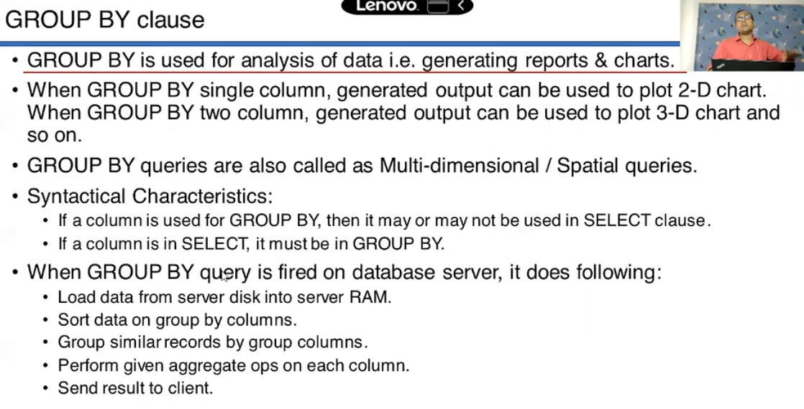
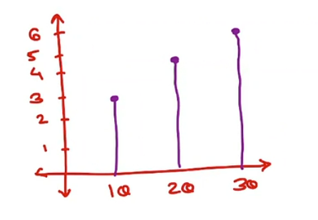
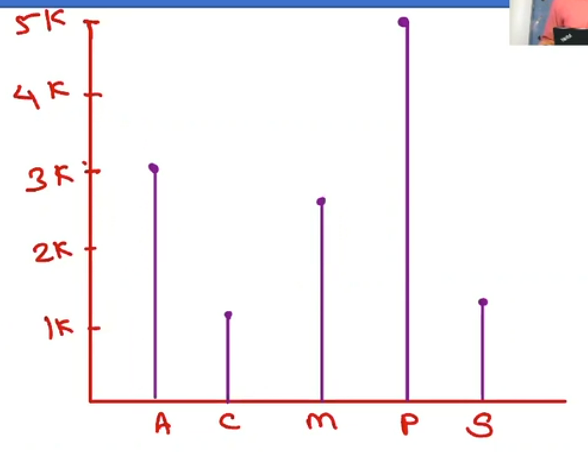
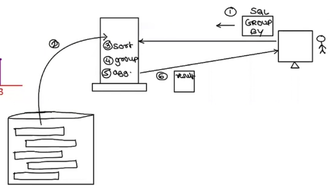
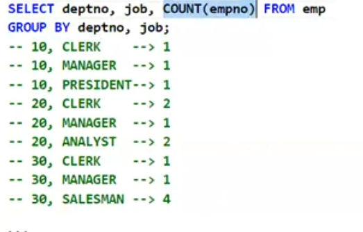
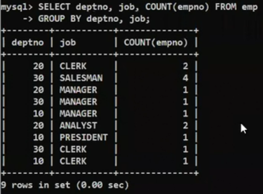
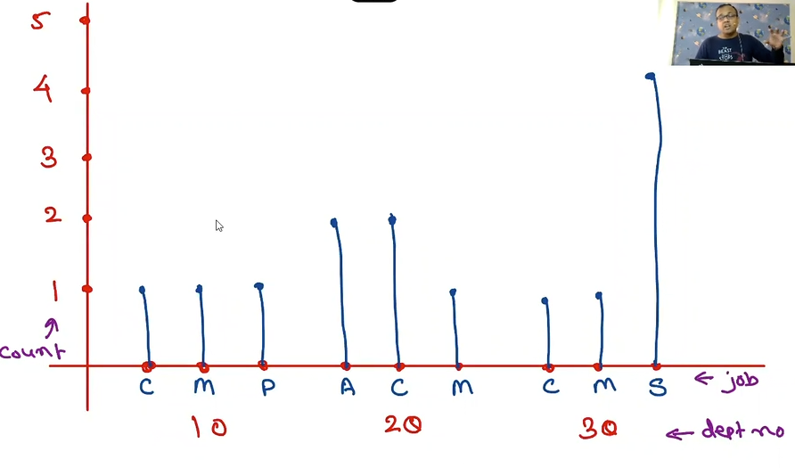

# SQL Functions
* Single row fun 
    * no rows of input == output rows
    
    
   
* Multi row fun
    * input multiple row --> output is single row
    

## Multi-row OR Group functions OR Aggregate functions
    * Values from multiple rows are aggregated to single value
    - sum() , min(), max(), count() ,avg() 
## Group functions
- group functions ignore null values
- cannot select group function along with column.
- Cannot select group function along with a single row fun.
- cannot use group function in WHERE clause/condition.
- cannot nest a group function in another group fun.
```SQl
+-------+--------+-----------+------+------------+---------+---------+--------+
| empno | ename  | job       | mgr  | hire       | sal     | comm    | deptno |
+-------+--------+-----------+------+------------+---------+---------+--------+
|  7369 | Smith  | Clerk     | 7902 | 1980-12-17 |  800.00 |    NULL |     20 |
|  7499 | Allen  | Salesman  | 7698 | 1981-02-20 | 1600.00 |  300.00 |     30 |
|  7521 | Ward   | Salesman  | 7698 | 1981-02-22 | 1250.00 |  500.00 |     30 |
|  7566 | Jones  | Manager   | 7839 | 1981-04-02 | 2975.00 |    NULL |     20 |
|  7654 | Martin | Salesman  | 7698 | 1981-09-28 | 1250.00 | 1400.00 |     30 |
|  7698 | Blake  | Manager   | 7839 | 1981-05-01 | 2850.00 |    NULL |     30 |
|  7782 | Clark  | Manager   | 7839 | 1981-06-09 | 2450.00 |    NULL |     10 |
|  7788 | Scott  | Analyst   | 7566 | 1982-12-09 | 3000.00 |    NULL |     20 |
|  7839 | King   | President | NULL | 1981-11-17 | 5000.00 |    NULL |     10 |
|  7902 | Ford   | Analyst   | 7566 | 1981-12-03 | 3000.00 |    NULL |     20 |
+-------+--------+-----------+------+------------+---------+---------+--------+

-- Count()
mysql> SELECT Count(empno), Count(comm) from emp;
+--------------+-------------+
| Count(empno) | Count(comm) |
+--------------+-------------+
|           10 |           3 |
+--------------+-------------+
-- comm count is less -> some comm are null
-- Count() can't take null entries
-- if we want to include null in count then 
mysql> SELECT Count(comm) , Count( IFNULL(comm , 0) ) from emp;
+-------------+---------------------------+
| Count(comm) | Count( IFNULL(comm , 0) ) |
+-------------+---------------------------+
|           3 |                        10 |
+-------------+---------------------------+

-- Sum()

mysql> SELECT Sum(sal) , Sum(comm) from emp;
+----------+-----------+
| Sum(sal) | Sum(comm) |
+----------+-----------+
| 24175.00 |   2200.00 |
+----------+-----------+
-- here in sum of comm null are ignored

-- AVG()
mysql> SELECT AVG(sal) , AVG(comm) from emp;
+-------------+------------+
| AVG(sal)    | AVG(comm)  |
+-------------+------------+
| 2417.500000 | 733.333333 |
+-------------+------------+

-- MAX() and MIN()
mysql> SELECT MAX(sal) , MAX(comm) , Min(sal) , MIN(comm) from emp;
+----------+-----------+----------+-----------+
| MAX(sal) | MAX(comm) | Min(sal) | MIN(comm) |
+----------+-----------+----------+-----------+
|  5000.00 |   1400.00 |   800.00 |    300.00 |
+----------+-----------+----------+-----------+
```
```SQL
mysql> SELECT ename ,  SUM(sal) from emp ;  -- can't use with column
/*
ERROR 1140 (42000): In aggregated query without GROUP BY, expression #1 of SELECT list contains nonaggregated column 'cdacdb.emp.ename'; this is incompatible with sql_mode=only_full_group_by */

mysql> SELECT LOWER(ename) ,  SUM(sal) from emp ; -- can't use with single row fun (lower is single row function)
/*
ERROR 1140 (42000): In aggregated query without GROUP BY, expression #1 of SELECT list contains nonaggregated column 'cdacdb.emp.ename'; this is incompatible with sql_mode=only_full_group_by
mysql> */

-- cannot use in WHERE condition
mysql> SELECT * from emp WHERE sal= MAX(sal) ;
ERROR 1111 (HY000): Invalid use of group function

-- can't nest 
mysql> SELECT Count( Sum(sal) ) from emp ;
ERROR 1111 (HY000): Invalid use of group function
```


- check if our mySQL has all setup to run Group_BY queries
- ONLY_FULL_GROUP_BY 
```SQl
mysql>  SELECT @@sql_mode ;
+-----------------------------------------------------------------------------------------------------------------------+
| @@sql_mode
                                     |
+-----------------------------------------------------------------------------------------------------------------------+
| ONLY_FULL_GROUP_BY,STRICT_TRANS_TABLES,NO_ZERO_IN_DATE,NO_ZERO_DATE,ERROR_FOR_DIVISION_BY_ZERO,NO_ENGINE_SUBSTITUTION |
+-----------------------------------------------------------------------------------------------------------------------+
1 row in set (0.01 sec)
```
### Group By clause


```SQL
SELECT deptno , Count(empno) from emp ;
-- error

SELECt deptno , Count(empno) from emp Group By deptno ;
--> 10 rows --> 2 emp in dept = 10 
            --> 4 emp in dept = 20
            --> 4 emp in dept = 30
+--------+--------------+
| deptno | Count(empno) |
+--------+--------------+
|     20 |            4 |
|     30 |            4 |
|     10 |            2 |
+--------+--------------+

mysql> SELECT job , count(empno) from emp Group By job ;
+-----------+--------------+
| job       | count(empno) |
+-----------+--------------+
| Clerk     |            1 |
| Salesman  |            3 |
| Manager   |            3 |
| Analyst   |            2 |
| President |            1 |
+-----------+--------------+

mysql> SELECT  job from emp Group By job ;
+-----------+
| job       |
+-----------+
| Clerk     |
| Salesman  |
| Manager   |
| Analyst   |
| President |
+-----------+

mysql> SELECT subject from book group by subject ;
+----------------------+
| subject              |
+----------------------+
| Programming          |
| Web Development      |
| Database Management  |
| Software Engineering |
+----------------------+
```
```SQL
mysql> SELECT deptno , Count(empno) from  emp Group By deptno ;
+--------+--------------+
| deptno | Count(empno) |
+--------+--------------+
|     20 |            4 |
|     30 |            4 |
|     10 |            2 |
+--------+--------------+
-- output from group by can represented in some sort of chart
```
 - ON X-axis->deptno , Y-axis-> no if emp

```SQL
mysql> SELECT job , AVG(sal) from emp GROUP BY job ;
+-----------+-------------+
| job       | AVG(sal)    |
+-----------+-------------+
| Clerk     |  800.000000 |
| Salesman  | 1366.666667 |
| Manager   | 2758.333333 |
| Analyst   | 3000.000000 |
| President | 5000.000000 |
+-----------+-------------+
```
 - we can convert the results from group by into graph
- what internally happens when we fire group by query
 
- group by on multiple columns and/or too many rows slows down execution. 

### GROUP BY on multiple column 

```SQL
mysql> SELECT deptno , job from emp ;
+--------+-----------+
| deptno | job       |
+--------+-----------+
|     20 | Clerk     |
|     30 | Salesman  |
|     30 | Salesman  |
|     20 | Manager   |
|     30 | Salesman  |
|     30 | Manager   |
|     10 | Manager   |
|     20 | Analyst   |
|     10 | President |
|     20 | Analyst   |
+--------+-----------+

-- used order by
+--------+-----------+
|     10 | Manager   | --> 1
|     10 | President | --> 1
|     20 | Clerk     | --> 1
|     20 | Manager   | --> 1
|     20 | Analyst   | --> 2 analyst in dept 20
|     20 | Analyst   |
|     30 | Salesman  | --> 3 salesman in dept 30
|     30 | Salesman  |
|     30 | Salesman  |
|     30 | Manager   | --> 1
+--------+-----------+
--> to get distinct job in dept

SELECT deptno , job , COUNT(empno) from emp GROUP BY deptno , job ;

mysql> SELECT deptno , job , COUNT(empno) from emp GROUP BY deptno , job ;
+--------+-----------+--------------+
| deptno | job       | COUNT(empno) |
+--------+-----------+--------------+
|     20 | Clerk     |            1 |
|     30 | Salesman  |            3 |
|     20 | Manager   |            1 |
|     30 | Manager   |            1 |
|     10 | Manager   |            1 |
|     20 | Analyst   |            2 |
|     10 | President |            1 |
+--------+-----------+--------------+
```
- from SIR's table

 


### Group By with WHERE clause
* WHERE clause will filter records from table
* group By will group it and perform aggregate operation
```SQL


mysql> SELECT job , SUM(sal) from emp GROUP BY job ;
+-----------+----------+
| job       | SUM(sal) |
+-----------+----------+
| Clerk     |   800.00 |
| Salesman  |  4100.00 |
| Manager   |  8275.00 |
| Analyst   |  6000.00 |
| President |  5000.00 |
+-----------+----------+

mysql> SELECT job , SUM(sal) from emp WHERE deptno != 10 GROUP BY job ;
+----------+----------+
| job      | SUM(sal) |
+----------+----------+
| Clerk    |   800.00 |
| Salesman |  4100.00 |
| Manager  |  5825.00 |
| Analyst  |  6000.00 |
+----------+----------+
-- here dept 20 , 30 doesn't contains president --> it get eliminated by where clause

mysql> SELECT job , SUM(sal) from emp WHERE sal> 1200 GROUP BY job ;
+-----------+----------+
| job       | SUM(sal) |
+-----------+----------+
| Salesman  |  4100.00 |
| Manager   |  8275.00 |
| Analyst   |  6000.00 |
| President |  5000.00 |
+-----------+----------+
-- no clerk has sal > 1200


mysql> SELECT job , SUM(sal) from emp
    -> WHERE job in ( 'salesman' , 'MANAGER')
    -> Group By job ;
+----------+----------+
| job      | SUM(sal) |
+----------+----------+
| Salesman |  4100.00 |
| Manager  |  8275.00 |
+----------+----------+
2 rows in set (0.00 sec)
```

### HAVING CLAUSE
- used to filter the result based on 'aggregate fun'
- must be used with GROUP BY and after it
- used to put condition based on agg fun and/or grouped coulumn only


```SQL
-- find job whose avg sal is more than 1200.


mysql> SELECT job , AVG(sal) from emp GROUP BY job;
+-----------+-------------+
| job       | AVG(sal)    |
+-----------+-------------+
| Clerk     |  800.000000 |
| Salesman  | 1366.666667 |
| Manager   | 2758.333333 |
| Analyst   | 3000.000000 |
| President | 5000.000000 |
+-----------+-------------+
-- 1st we need to group
-- 2nd we need to apply condition on aggregate fun

mysql> SELECT job , AVG(sal) as avg_sal from emp WHERE AVG(sal) > 1200 Group By job ;
ERROR 1111 (HY000): Invalid use of group function
-- in where clause group fun can't be used
-- how apply condition on aggregate fun
-- we have HAVING CLAUSE


mysql> SELECT job , AVG(sal) from emp GROUP BY job HAVING AVG(sal) > 1200;
+-----------+-------------+
| job       | AVG(sal)    |
+-----------+-------------+
| Salesman  | 1366.666667 |
| Manager   | 2758.333333 |
| Analyst   | 3000.000000 |
| President | 5000.000000 |
+-----------+-------------+

mysql> SELECT job , AVG(sal) from emp GROUP BY job HAVING sal > 1200;
ERROR 1054 (42S22): Unknown column 'sal' in 'having clause'
-- here in having clause used only Aggregate/groupped column only 


-- now having with groupped colunm job
mysql> SELECT job , AVG(sal) from emp GROUP BY job HAVING job in ( 'salesman' , 'MANAGER');
+----------+-------------+
| job      | AVG(sal)    |
+----------+-------------+
| Salesman | 1366.666667 |
| Manager  | 2758.333333 |
+----------+-------------+
-- in case of having with groupped column
-- having fetch all emp then apply condition
-- but in where clause condition is apply first 
-- having on groupprd colunm slows the execution
-- use having in aggregate column recommended
```
## group by with order by

```SQL
-- print avg sal per job in sorted order of job
mysql> SELECT job , AVG(sal) from emp GROUP BY job Order by job ;
+-----------+-------------+
| job       | AVG(sal)    |
+-----------+-------------+
| Analyst   | 3000.000000 |
| Clerk     |  800.000000 |
| Manager   | 2758.333333 |
| President | 5000.000000 |
| Salesman  | 1366.666667 |
+-----------+-------------+


-- print avg sal per job in sorted order of avg sal
mysql> SELECT job , AVG(sal) from emp GROUP BY job Order by AVG(sal) ;
+-----------+-------------+
| job       | AVG(sal)    |
+-----------+-------------+
| Clerk     |  800.000000 |
| Salesman  | 1366.666667 |
| Manager   | 2758.333333 |
| Analyst   | 3000.000000 |
| President | 5000.000000 |
+-----------+-------------+
mysql> SELECT job , AVG(sal) from emp GROUP BY job Order by 2 ; -- > here 2 means order by 2nd column in SELECT statement
-- same as above
+-----------+-------------+
| job       | AVG(sal)    |
+-----------+-------------+
| Clerk     |  800.000000 |
| Salesman  | 1366.666667 |
| Manager   | 2758.333333 |
| Analyst   | 3000.000000 |
| President | 5000.000000 |
+-----------+-------------+

-- also we can order by using alais
mysql> SELECT job , AVG(sal) as avgsal from emp GROUP BY job Order by avgsal ;
+-----------+-------------+
| job       | avgsal      |
+-----------+-------------+
| Clerk     |  800.000000 |
| Salesman  | 1366.666667 |
| Manager   | 2758.333333 |
| Analyst   | 3000.000000 |
| President | 5000.000000 |
+-----------+-------------+
```

### group by , order by with limit

```SQL
-- find the dept which spends max on sal of emps .
mysql> SELECT deptno , SUM(sal) from emp GROUP BY deptno ORDER BY SUM(sal) DESC LIMIT 1;
+--------+----------+
| deptno | SUM(sal) |
+--------+----------+
|     20 |  9775.00 |
+--------+----------+
1 row in set (0.00 sec)
```

```SQL
-- find dept which spend second lowest on income(sal+comm) of emp

mysql> SELECT deptno , SUM( sal + IFNULL(comm , 0) ) sum_Income from emp GROUP BY deptno ORDER By sum_Income ;
+--------+------------+
| deptno | sum_Income |
+--------+------------+
|     10 |    7450.00 |
|     30 |    9150.00 |
|     20 |    9775.00 |
+--------+------------+
-- first we find this
-- now use limit to show for second lowest dept
mysql> SELECT deptno , SUM( sal + IFNULL(comm , 0) ) sum_Income from emp GROUP BY deptno ORDER By sum_Income LIMIT 1,1 ;
+--------+------------+
| deptno | sum_Income |
+--------+------------+
|     30 |    9150.00 |
+--------+------------+
```
