# TRANSACTION

* Bank : account table ( acID , type, bal , ..... )
```SQl
-- transfer rs. 5000 from ac 1 to ac 2.

UPDATE accounts SET bal = bal - 5000 where acID =1;  -- debit
UPDATE accounts SET bal = bal + 5000 where acID =2;  -- credit

```
- but in client server scenarion something may affect the transaction.
* 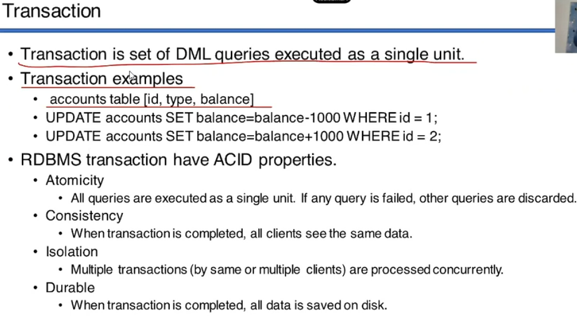
- Atomicity
- consistency
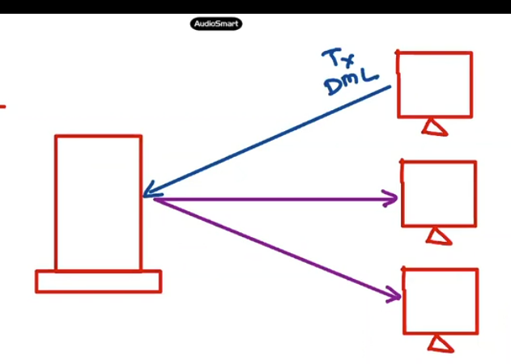
- isolation
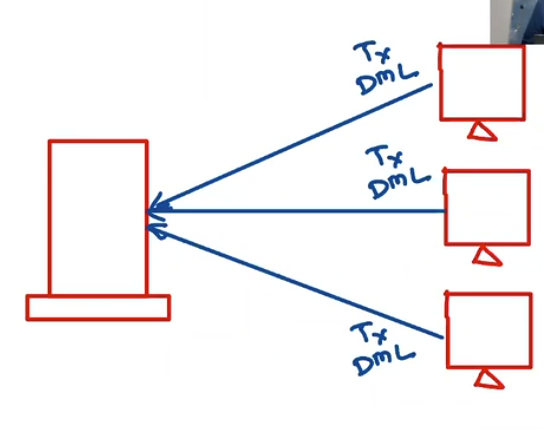
- Durable
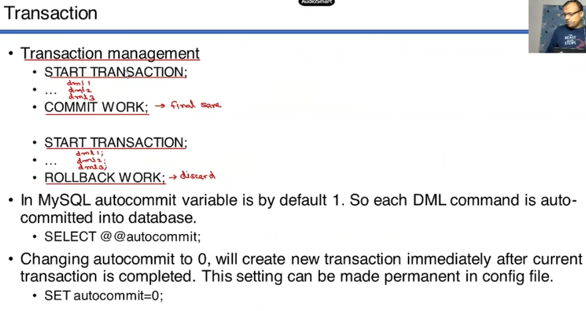

```SQL
CREATE TABLE accounts( acid int, type VARCHAR(20) , bal DECIMAL(10,2));
INSERT INTO accounts VALUES(1, 'saving' , 50000);
INSERT INTO accounts VALUES(2, 'saving' , 500);
SELECT * from accounts ;
/*
+------+--------+----------+
| acid | type   | bal      |
+------+--------+----------+
|    1 | saving | 50000.00 |
|    2 | saving |   500.00 |
+------+--------+----------+ */

START TRANSACTION ;
Query OK, 0 rows affected (0.00 sec)

-- now debit
UPDATE accounts SET bal = bal - 5000 where acID =1;  
mysql> SELECT * from accounts ;
+------+--------+----------+
| acid | type   | bal      |
+------+--------+----------+
|    1 | saving | 45000.00 |
|    2 | saving |   500.00 |
+------+--------+----------+

-- credit
UPDATE accounts SET bal = bal + 5000 where acID =2;  
mysql> SELECT * from accounts ;
+------+--------+----------+
| acid | type   | bal      |
+------+--------+----------+
|    1 | saving | 45000.00 |
|    2 | saving |  5500.00 |
+------+--------+----------+

-- now commit
mysql> COMMIT WORK;
Query OK, 0 rows affected (0.00 sec)
```
```SQL

mysql> SELECT * from accounts ;
+------+--------+----------+
| acid | type   | bal      |
+------+--------+----------+
|    1 | saving | 45000.00 |
|    2 | saving |  5500.00 |
+------+--------+----------+

-- 1. Start the transaction
START TRANSACTION;
-- 2. debit RS.2000 for this transaction
UPDATE accounts SET bal = bal - 2000 where acID =1; 
-- 3. credit into second account
UPDATE accounts SET bal = bal + 2000 where acID =2; 
-- see the changes --> transaction done 
mysql> SELECT * from accounts;
+------+--------+----------+
| acid | type   | bal      |
+------+--------+----------+
|    1 | saving | 43000.00 |
|    2 | saving |  7500.00 |
+------+--------+----------+
-- 4. now I want undo roll back , cancle this transaction
ROLLBACK WORK;

-- see the original table
mysql> SELECT * from accounts ;
+------+--------+----------+
| acid | type   | bal      |
+------+--------+----------+
|    1 | saving | 45000.00 |
|    2 | saving |  5500.00 |
+------+--------+----------+

```

- START TRANSACTION;
    * is no transaction is started every DML operation is auto commited by default
    * once the transaction is started , all DML operation changes will be saved in temporary tables on server (not on hard disk)
    * temp table is created for each transaction  
- do some work , fires some queries
- COMMIT WORK; --> here keyword is optional (ANSI)
- ROLLBACK WORK;

- --> changes are user specific 
- the moment we commit then changes are reflected for all clients
- 
- 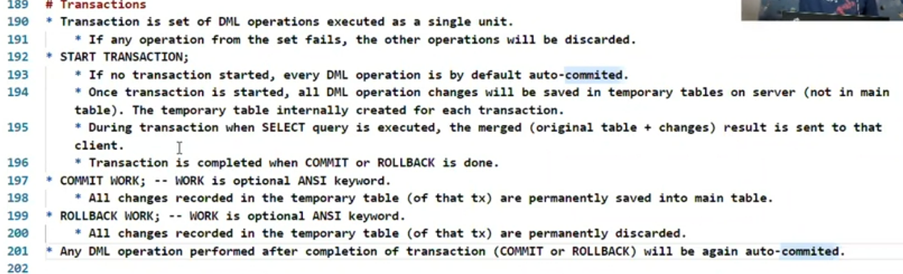 

### autocommit --> another way to start the transaction
* autocommit is  MySQL specific
* autocommit is variable 
* default set to 1.
* 1 means all DML  are auto commited. 
* autocommit 1 --> there will be sperate transaction for each DML query.
* there will seperate commit for each query
* no option to roll back , 
* it can be changed at session level or global level 
    * session level
        * applicable only for current client session ( when client exit, setting is restored).
        * SET autocommit = 0
    * Global level
        * applicale for all session of all user/clients. 
        * set into my.ini file ( by database admin ).
```SQL
-- show current status 
mysql> SELECT @@autocommit ;
+--------------+
| @@autocommit |
+--------------+
|            1 |
+--------------+
1 row in set (0.00 sec)
```
### set autocommit to zero
```SQL
mysql> SET autocommit = 0 ;
Query OK, 0 rows affected (0.01 sec)

mysql> SELECT @@autocommit ;
+--------------+
| @@autocommit |
+--------------+
|            0 |
+--------------+

-- from this point onward all DML will not be commited auto
-- lets delete some data

mysql> DELETE from accounts ;
Query OK, 2 rows affected (0.00 sec)

-- check
mysql> SELECT * from accounts;
Empty set (0.00 sec)

-- now rollback
mysql> ROLLBACK ;
Query OK, 0 rows affected (0.00 sec)

mysql> SELECT * from accounts;
+------+--------+----------+
| acid | type   | bal      |
+------+--------+----------+
|    1 | saving | 45000.00 |
|    2 | saving |  5500.00 |
+------+--------+----------+
2 rows in set (0.00 sec)

-- now we do rollback means transaction is closed

-- lets check by doing some DML
mysql> INSERT INTO accounts VALUES( 3, 'saving' , 30000) ;
Query OK, 1 row affected (0.00 sec)

mysql> SELECT * from accounts;
+------+--------+----------+
| acid | type   | bal      |
+------+--------+----------+
|    1 | saving | 45000.00 |
|    2 | saving |  5500.00 |
|    3 | saving | 30000.00 |
+------+--------+----------+
3 rows in set (0.00 sec)
-- data is added

-- but what if we do roll back now
mysql> ROLLBACK ;
Query OK, 0 rows affected (0.00 sec)

-- it allow us to roll back --> bcoz new transaction is started after previous rollback
mysql> SELECT * FROM accounts;
+------+--------+----------+
| acid | type   | bal      |
+------+--------+----------+
|    1 | saving | 45000.00 |
|    2 | saving |  5500.00 |
+------+--------+----------+
2 rows in set (0.00 sec)
```
* the moment we set autocommit = 0 
* the new transaction is started .
* and if we do commit/rollback -> transaction is ended.
* but as soon as we do roll back , after that new Transaction is started
* no need to start it manually

* 
* 
* need to EXIT  from this session to restore the default setting

* 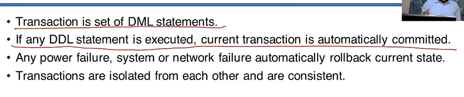
- DDL command commits the current transaction 
- becareful using DDl in between Transaction 
- our changes will saved permenantly
- no chance to rollback those changes now
* when exit done in between current transaction is rollbacked.
 
 ## SAVE POINT

 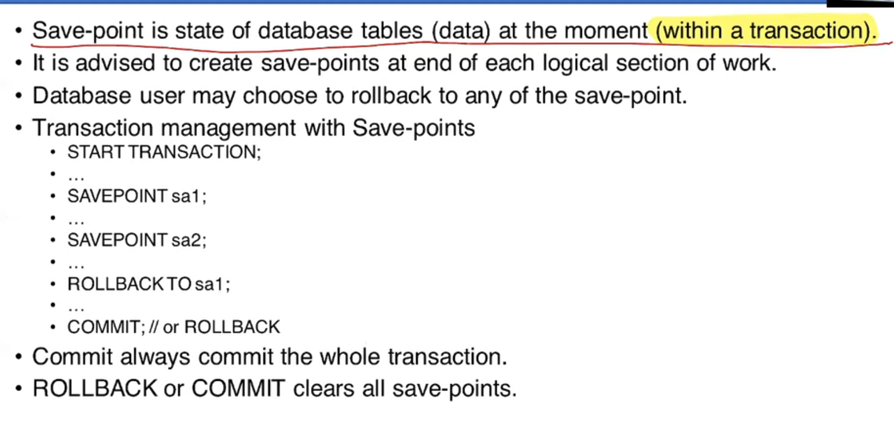
 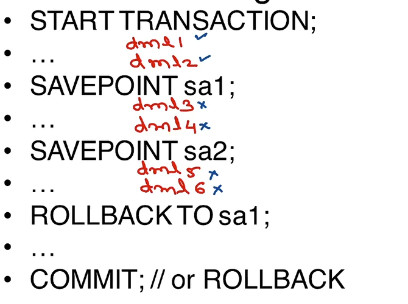
 - start transaction
 - create savepoints
 - rollback to that savepoint 
 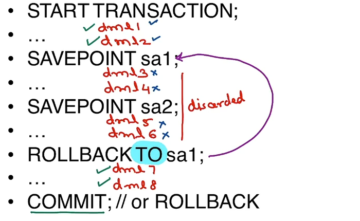
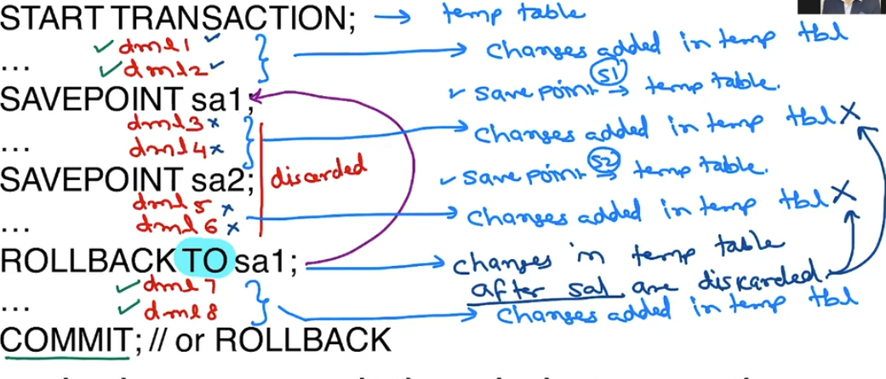

# LOCKING

## Optimistic Locking

- start two clients .
- check user , database
- start transactino from 1st
- delete some data DML query from 1st 
-  suppose we are doing some DML on record , 
- obviosly it will happen on temp table
- but this record will be get locked
-
- suppose my 2nd client try to use DML on same record that has been locked by 1st client.
- in such case 2nd client will be blocked 
- 2nd client can't use DML on that record.
- util 1st client commit
- if 1st client commits the changes.
- then 2nd client's DML can be executed on that record
- now changes can be reflected to both clients  
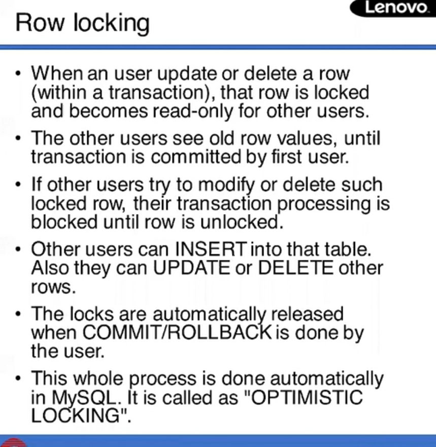
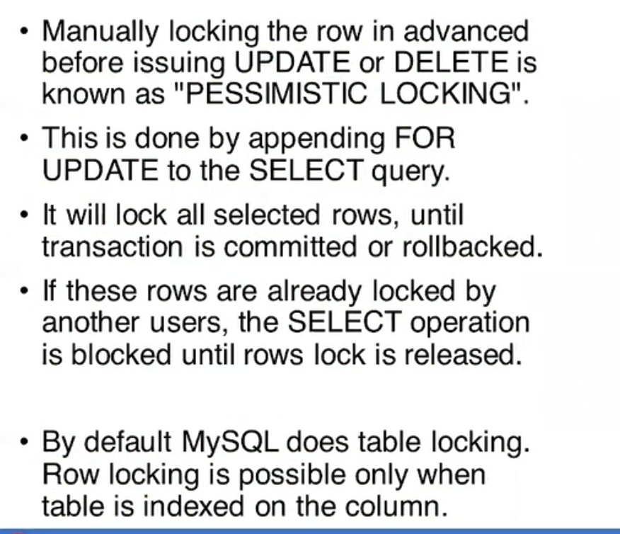
https://nickolasfisher.com/blog/Optimistic-Locking-in-MySQLExplain-Like-Im-Five

## Pessimistic Locking
- locking in advance
- before firing DML query 
- but why in advance we have to locking
- in app like booking app like bookmyshow , IRCTC , redbus
- here if I select some seat it didn't get reserved yet
- it get final after payment get recived
- but we need to save it for user until it payment received
- but by dafault locking is done by mysql after updating/deleting row
- but we need to locking it before that
- it us possible by pessimistic locking
- this all happens within transaction

```SQL
START TRANSACTION;

SELECT * from acconts WHERE acid=2 FOR UPDATE; -- locked here
-- now 2nd user can't update/delete this record before our update query
UPDATE accounts SET bal=12000 WHERE acid=2 ;


```