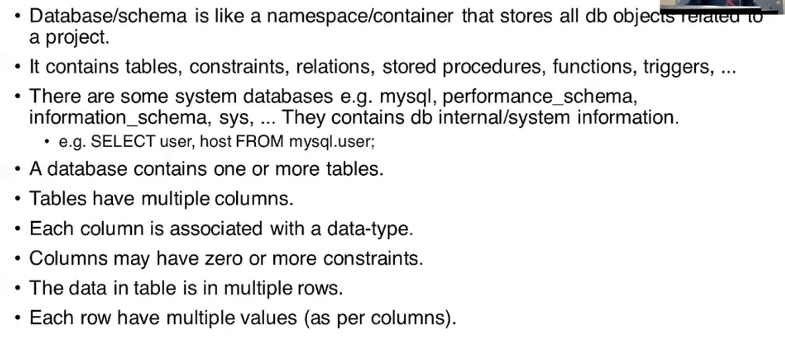

  


```SQL
CREATE USER flash@localhost IDENTIFIED BY 'flash';

CREATE DATABASE cdacdb;

GRANT ALL PRIVILEGES ON cdacdb.* TO flash@localhost;

FLUSH PRIVILEGES;

EXIT;
```
- here my user -> flash 
       -  password - > flash
        - CREATE USER flash@localhost IDENTIFIED BY 'flash';


```CMD
mysql -u flash -p

```
pass : flash 


- my user has some permission not all .

- TO CREATE TABLE IN DATABASE

```SQL
mysql> show databases;
+--------------------+
| Database           |
+--------------------+
| cdacdb             |
| information_schema |
| performance_schema |
+--------------------+

mysql> use cdacdb;
Database changed
mysql> show tables;
Empty set (0.04 sec)

mysql> create table student(id INT, name VARCHAR(20),marks DOUBLE);
Query OK, 0 rows affected (0.05 sec)

mysql> INSERT INTO student VALUES(1,'SHRIKANT',76.88);
Query OK, 1 row affected (0.01 sec)

mysql> SELECT * FROM STUDENT;
+------+----------+-------+
| id   | name     | marks |
+------+----------+-------+
|    1 | SHRIKANT | 76.88 |
+------+----------+-------+

mysql>  INSERT INTO student VALUES(2,'ELON',87.88);
Query OK, 1 row affected (0.00 sec)

mysql> SELECT * FROM  STUDENT;
+------+----------+-------+
| id   | name     | marks |
+------+----------+-------+
|    1 | SHRIKANT | 76.88 |
|    2 | ELON     | 87.88 |
+------+----------+-------+
2 rows in set (0.00 sec)
```

- root user can access the whole database
- standard practise to create user on grant some permission to it
- 

# root login

```SQL
mysql -u root -p
password: cdac

// check what is my user and in which database iam in now;

mysql> SELECT USER() , DATABASE();
+----------------+------------+
| USER()         | DATABASE() |
+----------------+------------+
| root@localhost | NULL       |
+----------------+------------+
1 row in set (0.00 sec)
```

- HOW TO CLEAR SCREEN in mysql
```SQL
\! cls 
```

- admin user can see all databases
```SQL
mysql> show databases;
+--------------------+
| Database           |
+--------------------+
| cdacdb             |
| information_schema |
| mysql              |
| performance_schema |
| shridb             |
| sys                |
+--------------------+
6 rows in set (0.00 sec)

-- below are system databases contains db system info
-- mysql
-- sys 
-- performance_schema
-- information_schema

-- we can see all user as we are root
mysql> SELECT user FROM mysql.user;
+------------------+
| user             |
+------------------+
| flash            |
| mysql.infoschema |
| mysql.session    |
| mysql.sys        |
| root             |
+------------------+
5 rows in set (0.00 sec)
```
# MYSQL "flash" user login
- what are different way that we can do login

```SQL
C:\Users\shrik>mysql -u flash -p
Enter password: *****

-- CHECKING 

mysql> SELECT USER() , DATABASE();
+-----------------+------------+
| USER()          | DATABASE() |
+-----------------+------------+
| flash@localhost | NULL       |
+-----------------+------------+
1 row in set (0.00 sec)

-- NOW we are at flash user 
-- flash has not all permission

--  only thoes that has permission to user
mysql> SHOW DATABASES;
+--------------------+
| Database           |
+--------------------+
| cdacdb             |
| information_schema |
| performance_schema |
+--------------------+

-- now how to activate the database

mysql> USE cdacdb;
Database changed

-- its activated
-- whats proof

-- print current user and current database
mysql> SELECT USER(), DATABASE();
+-----------------+------------+
| USER()          | DATABASE() |
+-----------------+------------+
| flash@localhost | cdacdb     |
+-----------------+------------+
-- see here user DATABASE() -> we can see cdacdb

-- print tables in current database
mysql> SHOW TABLES;
+------------------+
| Tables_in_cdacdb |
+------------------+
| student          |
+------------------+
```

- 
- 
- 
* cnd> mysql -h localhost -u flash -p
    * -h server ip address/name
        * default = localhost -- current computer
    * -u -- my sql username to login
        * admin user = root
        * created user = flash
    * -p -- password
         * password: flash
```sql
mysql -h localhost -u flash -p
Enter password: ****
-- here paswword must be of flash user
```
* CREATE USER flash@localhost IDENTIFIED BY 'flash';


## other way 

* mysql -u flash -pflash
    * password must be immediatly after -p , no space , but can insecure
- but bydafualt use null no database

#### is there is way  

```SQL
>mysql -u flash -pflash cdacdb
-- here we are login with flash user and 
--flash password on current machine mysql server and activate database 'cdacdb' in one line

-- AFTER THIS 
mysql> SELECT USER(), DATABASE();
+-----------------+------------+
| USER()          | DATABASE() |
+-----------------+------------+
| flash@localhost | cdacdb     |
+-----------------+------------+
--  we are already using cdacdb database

-- without "use cdacdb" command

```
## insert values into table

```SQL
INsert into student values(3, 'Sam', 56.5);

-- or we can write multiple input in one statement
mysql> Insert into student values(4, 'ram',89.7),(5,'mike',87.55);
Query OK, 2 rows affected (0.00 sec)
Records: 2  Duplicates: 0  Warnings: 0

-- lets see what happend in our table

mysql> select * from student;
+------+----------+-------+
| id   | name     | marks |
+------+----------+-------+
|    1 | SHRIKANT | 76.88 |
|    2 | ELON     | 87.88 |
|    3 | Sam      |  56.5 |
|    4 | ram      |  89.7 |
|    5 | mike     | 87.55 |
+------+----------+-------+
5 rows in set (0.00 sec)

-- rows -> records, entities

```
## Logical layout
 
 

### to show table structure 
```SQL
-- use desc command to describe its structure , its metadata.

mysql> DESCRIBE student;
+-------+-------------+------+-----+---------+-------+
| Field | Type        | Null | Key | Default | Extra |
+-------+-------------+------+-----+---------+-------+
| id    | int         | YES  |     | NULL    |       |
| name  | varchar(20) | YES  |     | NULL    |       |
| marks | double      | YES  |     | NULL    |       |
+-------+-------------+------+-----+---------+-------+

-- thid whole info is meta data abt my TABLE

```
## physical layout


* this physical layout understanding is only for general knowedge.

### importing into database
- can be done using source command
```SQL
-- SOURCE /path/to/the/sql/file

-- SOURCE C:\BraveDownloads\DBT\Sample-SQL-File-10-Rows.sql

mysql> SOURCE C:\BraveDownloads\DBT\Sample-SQL-File-10-Rows.sql
Query OK, 0 rows affected, 2 warnings (0.05 sec)

Query OK, 10 rows affected (0.01 sec)
Records: 10  Duplicates: 0  Warnings: 0

mysql> SHOW TABLES;
+------------------+
| Tables_in_cdacdb |
+------------------+
| student          |
| user_details     |
+------------------+
2 rows in set (0.00 sec)

mysql> SELECT * FROM user_details;
+---------+----------+------------+-----------+--------+----------------------------------+--------+
| user_id | username | first_name | last_name | gender | password                         | status |
+---------+----------+------------+-----------+--------+----------------------------------+--------+
|       1 | rogers63 | david      | john      | Female | e6a33eee180b07e563d74fee8c2c66b8 |      1 |
|       2 | mike28   | rogers     | paul      | Male   | 2e7dc6b8a1598f4f75c3eaa47958ee2f |      1 |
|       3 | rivera92 | david      | john      | Male   | 1c3a8e03f448d211904161a6f5849b68 |      1 |
|       4 | ross95   | maria      | sanders   | Male   | 62f0a68a4179c5cdd997189760cbcf18 |      1 |
|       5 | paul85   | morris     | miller    | Female | 61bd060b07bddfecccea56a82b850ecf |      1 |
|       6 | smith34  | daniel     | michael   | Female | 7055b3d9f5cb2829c26cd7e0e601cde5 |      1 |
|       7 | james84  | sanders    | paul      | Female | b7f72d6eb92b45458020748c8d1a3573 |      1 |
|       8 | daniel53 | mark       | mike      | Male   | 299cbf7171ad1b2967408ed200b4e26c |      1 |
|       9 | brooks80 | morgan     | maria     | Female | aa736a35dc15934d67c0a999dccff8f6 |      1 |
|      10 | morgan65 | paul       | miller    | Female | a28dca31f5aa5792e1cefd1dfd098569 |      1 |
```

### how to create table
- command 'create table' ;
- CREATE TABLE table_name(column_name1 COL-TYPE, column_name2 COL-TYPE ....., constraint);

## DATA TYPES

- all RDBMS have similar data type
- for mysql-> INT , DECIMAL , FLOAT
- for oracle-> NUMBER
- for DERBY-> INTEGER

#### numeric types: (INTEGER)
- TINYINT (1 byte): 8 bit -> 1 bit MSB ->range-> -128 to 127
- SMALLINT (2 byte): 16 bit:
- MEDIUMINT (3 byte) : 24 bit:

- INT ( 4 byte ): 32 bit
- BIGINT(8 byte): 64 bit
- BIT();
* these data types are by default signed
    * to make it unsigned
    * -- student( a1 smallint unsigned, a2 int unsiged).
*  

#### numeric type (floating point)
- not exact , 
- approx precision -> stored in IEEE - 754 format , like in all programming lang.
- same as C lang
- FLOAT (4 byte), DOUBLE (8 byte), 
- if we lookning for accuracy then use decimal
- DECIMAL(m ,n) - for excat precision
- CREATE TABLE CITY( ID DECIMAL(8 , 3));
- here 8 -> is all our 8 digit 
- and 3 -> three decimal places
- eg --> 12345.678

#### date time types
- DATE, 
- TIME -> hr , min, sec, => its like duration , not time of day
- DATETIME , like 
- TIMESTAMP => like no of sec from 1 JAN 1997;
- YEAR = > 

### String types
- CHAR ( 1 - 255 )-> for small data
- VARCHAR (1 - 65535) -> for larger data

##### TEXT category: 

```SQL

mysql> create table test( c1 char(10) , c2 varchar(10) , c3 text(10));
Query OK, 0 rows affected (0.03 sec)

mysql> insert into test values ( 'abcd' , 'abcd' , 'abcd');
Query OK, 1 row affected (0.01 sec)

mysql> select * from test;
+------+------+------+
| c1   | c2   | c3   |
+------+------+------+
| abcd | abcd | abcd |
+------+------+------+

-- we have create c1 c2 c3 but output wise is smae
+-------+-------------+------+-----+---------+-------+
| Field | Type        | Null | Key | Default | Extra |
+-------+-------------+------+-----+---------+-------+
| c1    | char(10)    | YES  |     | NULL    |       |
| c2    | varchar(10) | YES  |     | NULL    |       |
| c3    | tinytext    | YES  |     | NULL    |       |
+-------+-------------+------+-----+---------+-------+
```

- c1 char(10) 
- c2 varchar(10) 
- c3 text(10)
 - char types are fixed size 
    * in char type of size 10 -> if we put only 4 size data , then remaining 6 spaces get unused.
- varchar is variable in size
- 
- all the text type data is stored outside of row 
- only pointer to that space is kept on row
- 

- varchar is slower than char bcoz first we need to read size then data;
- likewise text is very slow in terms of access bcoz there is pointer involed.

```SQL 
mysql> insert into test values( 'abcdefghijk' , 'abcdefghijk' , 'abcdefghijk' );
ERROR 1406 (22001): Data too long for column 'c1' at row 1

-- here it gave us en error for c1 which is char type with size 10
-- our input was size of 11
```

- now let make c1 with 10, but c2 with 11 character 
```SQL
mysql> insert into test values( 'abcdefghij' , 'abcdefghijk' , 'abcdefghijk' );
ERROR 1406 (22001): Data too long for column 'c2' at row 1
 -- again error for c2
```
- now try with only c3 which is of size 10 but input was 11 character

```SQL
mysql> insert into test values( 'abcdefghij' , 'abcdefghij' , 'abcdefghijk' );
Query OK, 1 row affected (0.01 sec)

-- bcoz in tinytext upto 255 
```
```SQL
mysql> select * from test;
+------------+------------+-------------+
| c1         | c2         | c3          |
+------------+------------+-------------+
| abcd       | abcd       | abcd        |
| abcdefghij | abcdefghij | abcdefghijk |
+------------+------------+-------------+
```
- ideally in case of text no need for size , by default 255

#### showing strict mode
```SQL
mysql> SELECT @@sql_mode;
+-----------------------------------------------------------------------------------------------------------------------+
| @@sql_mode
                      |
+-----------------------------------------------------------------------------------------------------------------------+
| ONLY_FULL_GROUP_BY,STRICT_TRANS_TABLES,NO_ZERO_IN_DATE,NO_ZERO_DATE,ERROR_FOR_DIVISION_BY_ZERO,NO_ENGINE_SUBSTITUTION |
+-----------------------------------------------------------------------------------------------------------------------+
```
- i have 
- NO_ENGINE_SUBSTITUTION,
STRICT_TRANS_TABLES

- 
### binary types
- images , pdf , docs
- BINARY is same like String types
- use BLOB

### INSERT - DML

*  INSERT INTO tablename VALUES ( v1, v2 , v3 . ..);
    * String and Date/Time must be in single quotes.
    * Other values without quotes.
    * Values must be in *same order* as of column order. 
```SQL
mysql> select * from student;
+------+----------+-------+
| id   | name     | marks |
+------+----------+-------+
|    1 | SHRIKANT | 76.88 |
|    2 | ELON     | 87.88 |
|    3 | Sam      |  56.5 |
|    4 | ram      |  89.7 |
|    5 | mike     | 87.55 |
+------+----------+-------+
5 rows in set (0.00 sec)

mysql> INSERT INTO student VALUES( 87.33 , 7, 'RAM');
ERROR 1265 (01000): Data truncated for column 'marks' at row 1
```
- order must be same 
- unless if you directed in such way
```SQL
INSERT INTO student (marks, id , name) VALUES(87.33 , 7, 'RAM');


mysql> INSERT INTO student (id , name) VALUES(10 , 'sam');
Query OK, 1 row affected (0.00 sec)

mysql> SELECT * FROM student;
+------+----------+-------+
| id   | name     | marks |
+------+----------+-------+
|    1 | SHRIKANT | 76.88 |
|    2 | ELON     | 87.88 |
|    3 | Sam      |  56.5 |
|    4 | ram      |  89.7 |
|    5 | mike     | 87.55 |
|    7 | RAM      | 87.33 |
|   10 | sam      |  NULL |
```
- is we dont provide a value to a col , then at that time it will taken as NULL.
- NULL is keyword
- we can manually put NULL also
-  INSERT INTO student (id , name) VALUES(10 , 'sam' , NULL );

#### insert data from one table into new table
- INSERT INTO  new_table SELECT * FROM student;
    * the count and order of columns in new_table must be same as old table.

-  we insert some specific column from student into new_table;
    * INSERT INTO new_table(c1, c2) SELECT c1, c2 FROM student;
    * column c1 and c2 from student into new_table;

```SQL
mysql> select * from student;
+------+----------+-------+
| id   | name     | marks |
+------+----------+-------+
|    1 | SHRIKANT | 76.88 |
|    2 | ELON     | 87.88 |
|    3 | Sam      |  56.5 |
|    4 | ram      |  89.7 |
|    5 | mike     | 87.55 |
|    7 | RAM      | 87.33 |
|   10 | sam      |  NULL |
|   10 | sam      |  NULL |
+------+----------+-------+
8 rows in set (0.00 sec)

mysql> CREATE TABLE new_table( roll INT , name CHAR(20) );
Query OK, 0 rows affected (0.04 sec)

mysql> INSERT INTO new_table(roll , name) SELECT id , name FROM student;
Query OK, 8 rows affected (0.01 sec)
Records: 8  Duplicates: 0  Warnings: 0

mysql> SELECT * FROM new_table;
+------+----------+
| roll | name     |
+------+----------+
|    1 | SHRIKANT |
|    2 | ELON     |
|    3 | Sam      |
|    4 | ram      |
|    5 | mike     |
|    7 | RAM      |
|   10 | sam      |
|   10 | sam      |
+------+----------+
8 rows in set (0.00 sec)
```

# DAY 4 

### select - DQL

- 
```SQL
mysql> select * from student ;
+------+----------+-------+
| id   | name     | marks |
+------+----------+-------+
|    1 | SHRIKANT | 76.88 |
|    2 | ELON     | 87.88 |
|    3 | Sam      |  56.5 |
|    4 | ram      |  89.7 |
|    5 | mike     | 87.55 |
|    7 | RAM      | 87.33 |
|   10 | sam      |  NULL |
|   10 | sam      |  NULL |
+------+----------+-------+
```
- here  when we write SELECT query with *
- it will show all data in fixed order.
- the order in which we create table
- but if we want to show in custom order then 
- specify the order.
```SQL
mysql> SELECT name , marks, id from student;
+----------+-------+------+
| name     | marks | id   |
+----------+-------+------+
| SHRIKANT | 76.88 |    1 |
| ELON     | 87.88 |    2 |
| Sam      |  56.5 |    3 |
| ram      |  89.7 |    4 |
| mike     | 87.55 |    5 |
| RAM      | 87.33 |    7 |
| sam      |  NULL |   10 |
| sam      |  NULL |   10 |
+----------+-------+------+

```

-- fetch id , name and sal from emp table
```SQL
mysql> select * from emp;
+-------+--------+-----------+------+------------+---------+---------+--------+
| empno | ename  | job       | mgr  | hire       | sal     | comm    | deptno |
+-------+--------+-----------+------+------------+---------+---------+--------+
|  7369 | Smith  | Clerk     | 7902 | 1980-12-17 |  800.00 |    NULL |     20 |
|  7499 | Allen  | Salesman  | 7698 | 1981-02-20 | 1600.00 |  300.00 |     30 |
|  7521 | Ward   | Salesman  | 7698 | 1981-02-22 | 1250.00 |  500.00 |     30 |
|  7566 | Jones  | Manager   | 7839 | 1981-04-02 | 2975.00 |    NULL |     20 |
|  7654 | Martin | Salesman  | 7698 | 1981-09-28 | 1250.00 | 1400.00 |     30 |
|  7698 | Blake  | Manager   | 7839 | 1981-05-01 | 2850.00 |    NULL |     30 |
|  7782 | Clark  | Manager   | 7839 | 1981-06-09 | 2450.00 |    NULL |     10 |
|  7788 | Scott  | Analyst   | 7566 | 1982-12-09 | 3000.00 |    NULL |     20 |
|  7839 | King   | President | NULL | 1981-11-17 | 5000.00 |    NULL |     10 |
|  7902 | Ford   | Analyst   | 7566 | 1981-12-03 | 3000.00 |    NULL |     20 |
+-------+--------+-----------+------+------------+---------+---------+--------+
10 rows in set (0.00 sec)
-- -- fetch id , name and sal from emp table
mysql> SELECT  empno , ename ,sal from  emp;
+-------+--------+---------+
| empno | ename  | sal     |
+-------+--------+---------+
|  7369 | Smith  |  800.00 |
|  7499 | Allen  | 1600.00 |
|  7521 | Ward   | 1250.00 |
|  7566 | Jones  | 2975.00 |
|  7654 | Martin | 1250.00 |
|  7698 | Blake  | 2850.00 |
|  7782 | Clark  | 2450.00 |
|  7788 | Scott  | 3000.00 |
|  7839 | King   | 5000.00 |
|  7902 | Ford   | 3000.00 |
+-------+--------+---------+
``` 

- the select comman works
- but I want the heading of column different; 
```SQL

SELECT empno AS 'emp id' , ename AS 'emp name' , sal AS 'salary' from emp;

mysql> SELECT empno AS 'emp id' , ename AS 'emp name' , sal AS 'salary' from emp;
+--------+----------+---------+
| emp id | emp name | salary  |
+--------+----------+---------+
|   7369 | Smith    |  800.00 |
|   7499 | Allen    | 1600.00 |
|   7521 | Ward     | 1250.00 |
|   7566 | Jones    | 2975.00 |
|   7654 | Martin   | 1250.00 |
|   7698 | Blake    | 2850.00 |
|   7782 | Clark    | 2450.00 |
|   7788 | Scott    | 3000.00 |
|   7839 | King     | 5000.00 |
|   7902 | Ford     | 3000.00 |
+--------+----------+---------+ 

 -- as we can see the column name is changed 
 -- this changes are not on original table
 -- it is only on output on client 
```
 
 ### AS keyword
 - to create alias to a column
 - AS keyword is optional 
- its ok
 ```SQL
 mysql> SELECT empno 'emp id' , ename 'emp name' , sal  'salary' from emp;
 ```

 - 
 - if alias name contains space or special chars,
 - they must be quoted. ' '  or ` `
 - if alias name doesn't contain space or special char , quoets are optional .
 - 


## processing data while showing to client
```SQl
-- print book id , name , price, and gst ( 5% of price).
-- here on book table we dont have gst olumn

SELECT id , name , price , price*0.05 from book;
+----+---------+-------+------------+
| id | name    | price | price*0.05 |
+----+---------+-------+------------+
|  1 | Book 1  | 19.99 |     0.9995 |
|  2 | Book 2  | 24.95 |     1.2475 |
|  3 | Book 3  | 15.49 |     0.7745 |
|  4 | Book 4  | 29.99 |     1.4995 |
|  5 | Book 5  |  9.99 |     0.4995 |
|  6 | Book 6  | 32.50 |     1.6250 |
|  7 | Book 7  | 19.99 |     0.9995 |
|  8 | Book 8  | 21.75 |     1.0875 |
|  9 | Book 9  | 12.99 |     0.6495 |
| 10 | Book 10 | 17.25 |     0.8625 |
| 11 | Book 11 | 14.50 |     0.7250 |
| 12 | Book 12 | 23.75 |     1.1875 |
| 13 | Book 13 | 28.99 |     1.4495 |
| 14 | Book 14 |  9.99 |     0.4995 |
| 15 | Book 15 | 16.75 |     0.8375 |
+----+---------+-------+------------+

-- using alias
mysql> Select id , name , price mrp , price*0.05 AS GST from book;
+----+---------+-------+--------+
| id | name    | mrp   | GST    |
+----+---------+-------+--------+
|  1 | Book 1  | 19.99 | 0.9995 |
|  2 | Book 2  | 24.95 | 1.2475 |
|  3 | Book 3  | 15.49 | 0.7745 |
|  4 | Book 4  | 29.99 | 1.4995 |
|  5 | Book 5  |  9.99 | 0.4995 |
|  6 | Book 6  | 32.50 | 1.6250 |
|  7 | Book 7  | 19.99 | 0.9995 |
|  8 | Book 8  | 21.75 | 1.0875 |
|  9 | Book 9  | 12.99 | 0.6495 |
| 10 | Book 10 | 17.25 | 0.8625 |
| 11 | Book 11 | 14.50 | 0.7250 |
| 12 | Book 12 | 23.75 | 1.1875 |
| 13 | Book 13 | 28.99 | 1.4495 |
| 14 | Book 14 |  9.99 | 0.4995 |
| 15 | Book 15 | 16.75 | 0.8375 |
+----+---------+-------+--------+
```
- this GST column is not there in original table on hard disk.
- its a computed column . / sudo / virtual / derived column.
- its computed while run time . 

- -- print book id , name , price, and gst ( 5% of price) and total price -> price + gst ;
```SQL

mysql> SELECT id , name , price , price*0.05 GST , price+price*0.05 'Total price' from book;
+----+---------+-------+--------+-------------+
| id | name    | price | GST    | Total price |
+----+---------+-------+--------+-------------+
|  1 | Book 1  | 19.99 | 0.9995 |     20.9895 |
|  2 | Book 2  | 24.95 | 1.2475 |     26.1975 |
|  3 | Book 3  | 15.49 | 0.7745 |     16.2645 |
|  4 | Book 4  | 29.99 | 1.4995 |     31.4895 |
|  5 | Book 5  |  9.99 | 0.4995 |     10.4895 |
|  6 | Book 6  | 32.50 | 1.6250 |     34.1250 |
|  7 | Book 7  | 19.99 | 0.9995 |     20.9895 |
|  8 | Book 8  | 21.75 | 1.0875 |     22.8375 |
|  9 | Book 9  | 12.99 | 0.6495 |     13.6395 |
| 10 | Book 10 | 17.25 | 0.8625 |     18.1125 |
| 11 | Book 11 | 14.50 | 0.7250 |     15.2250 |
| 12 | Book 12 | 23.75 | 1.1875 |     24.9375 |
| 13 | Book 13 | 28.99 | 1.4495 |     30.4395 |
| 14 | Book 14 |  9.99 | 0.4995 |     10.4895 |
| 15 | Book 15 | 16.75 | 0.8375 |     17.5875 |
+----+---------+-------+--------+-------------+
```

 ```SQL
 SELECT id , name , price , price*0.05 GST , price+GST 'Total price' from book;l
ERROR 1064 (42000): You have an error in your SQL syntax; check the manual that corresponds to your MySQL server version for the right syntax to use near 'l
SELECT id , name , price , price*0.05 GST , price+GST 'Total price' from book' at line 1
 ```
  - we cant write a GST in total price column , bcoz GST is not exists .
  -- it only shows while run time

##### Print empno , ename, sal , category of employee (emp table).
- if salary < 1500 - > poor employee
- if salary <= 2500 -> middle.
- salary > 2500 -> rich.

```SQL
SELECT empno , ename , sal from emp ;

-- we have case statement
 SELECT empno , ename, sal,
    CASE
    WHEN sal <= 1500 THEN 'Poor'
    WHEN sal > 1500 AND sal <= 2500 THEN 'Middle'
    ELSE 'Rich'
    END AS  SalaryCategory
    FROM emp;

+-------+--------+---------+----------------+
| empno | ename  | sal     | SalaryCategory |
+-------+--------+---------+----------------+
|  7369 | Smith  |  800.00 | Poor           |
|  7499 | Allen  | 1600.00 | Middle         |
|  7521 | Ward   | 1250.00 | Poor           |
|  7566 | Jones  | 2975.00 | Rich           |
|  7654 | Martin | 1250.00 | Poor           |
|  7698 | Blake  | 2850.00 | Rich           |
|  7782 | Clark  | 2450.00 | Middle         |
|  7788 | Scott  | 3000.00 | Rich           |
|  7839 | King   | 5000.00 | Rich           |
|  7902 | Ford   | 3000.00 | Rich           |
+-------+--------+---------+----------------+

-- this was example of computedd columns
```
- Print empno , ename, sal , category of employee and deptno  
- deptno -> 10 = ACCOUNTS , 20 = RESEARCH , 30=SALES , *=OPERATIONS.

```sql
 SELECT empno , ename, sal,
    CASE
    WHEN sal <= 1500 THEN 'Poor'
    WHEN sal > 1500 AND sal <= 2500 THEN 'Middle'
    ELSE 'Rich'
    END AS  SalaryCategory ,

    deptno ,

    CASE
    WHEN deptno = 10 THEN 'ACCOUNTS'
    WHEN deptno = 20 THEN 'RESEARCH'
    WHEN deptno = 30 THEN 'SALES'
    ELSE 'OPERATIONS'
    END AS department 
    FROM emp;

+-------+--------+---------+----------------+--------+------------+
| empno | ename  | sal     | SalaryCategory | deptno | department |
+-------+--------+---------+----------------+--------+------------+
|  7369 | Smith  |  800.00 | Poor           |     20 | RESEARCH   |
|  7499 | Allen  | 1600.00 | Middle         |     30 | SALES      |
|  7521 | Ward   | 1250.00 | Poor           |     30 | SALES      |
|  7566 | Jones  | 2975.00 | Rich           |     20 | RESEARCH   |
|  7654 | Martin | 1250.00 | Poor           |     30 | SALES      |
|  7698 | Blake  | 2850.00 | Rich           |     30 | SALES      |
|  7782 | Clark  | 2450.00 | Middle         |     10 | ACCOUNTS   |
|  7788 | Scott  | 3000.00 | Rich           |     20 | RESEARCH   |
|  7839 | King   | 5000.00 | Rich           |     10 | ACCOUNTS   |
|  7902 | Ford   | 3000.00 | Rich           |     20 | RESEARCH   |
+-------+--------+---------+----------------+--------+------------+
```

- how many books we have
- nos of rows
```SQL
mysql> SELECT * from book;
+----+---------+-----------+-----------+-------+
| id | name    | author    | subject   | price |
+----+---------+-----------+-----------+-------+
|  1 | Book 1  | Author 1  | Subject A | 19.99 |
|  2 | Book 2  | Author 2  | Subject B | 24.95 |
|  3 | Book 3  | Author 3  | Subject C | 15.49 |
|  4 | Book 4  | Author 4  | Subject A | 29.99 |
|  5 | Book 5  | Author 5  | Subject D |  9.99 |
|  6 | Book 6  | Author 6  | Subject B | 32.50 |
|  7 | Book 7  | Author 7  | Subject A | 19.99 |
|  8 | Book 8  | Author 8  | Subject C | 21.75 |
|  9 | Book 9  | Author 9  | Subject D | 12.99 |
| 10 | Book 10 | Author 10 | Subject B | 17.25 |
| 11 | Book 11 | Author 11 | Subject A | 14.50 |
| 12 | Book 12 | Author 12 | Subject C | 23.75 |
| 13 | Book 13 | Author 13 | Subject D | 28.99 |
| 14 | Book 14 | Author 14 | Subject B |  9.99 |
| 15 | Book 15 | Author 15 | Subject A | 16.75 |
+----+---------+-----------+-----------+-------+
```
- we have only four unique subjects A B C D only
- how to fetch uniquie 
```sql
-- fetch unique subject from book

SELECT DISTINCT subject from book;

mysql> SELECT DISTINCT subject from book;
+-----------+
| subject   |
+-----------+
| Subject A |
| Subject B |
| Subject C |
| Subject D |
+-----------+
```
- fetch unique dept from emp
```sql
mysql> SELECT DISTINCT deptno from emp;
+--------+
| deptno |
+--------+
|     20 |
|     30 |
|     10 |
+--------+
```
```SQL
-- fetch unique job from emp
mysql> SELECT DISTINCT job from emp;
+-----------+
| job       |
+-----------+
| Clerk     |
| Salesman  |
| Manager   |
| Analyst   |
| President |
```

```SQL
mysql> select deptno , job from emp;
+--------+-----------+
| deptno | job       |
+--------+-----------+
|     20 | Clerk     |
|     30 | Salesman  |
|     30 | Salesman  |
|     20 | Manager   |
|     30 | Salesman  |
|     30 | Manager   |
|     10 | Manager   |
|     20 | Analyst   |
|     10 | President |
|     20 | Analyst   |
+--------+-----------+

-- now the questions is
-- how many unique jobs

-> deptno 10 ->  manager , president
-> deptno 20 ->  clerk , manager , analyst
-> deptno 30 ->  salesman , manager

```
- unique jobs per deptno or unique dept for per job
```SQL
mysql> SELECT DISTINCT deptno , job from emp;
+--------+-----------+
| deptno | job       |
+--------+-----------+
|     20 | Clerk     |
|     30 | Salesman  |
|     20 | Manager   |
|     30 | Manager   |
|     10 | Manager   |
|     20 | Analyst   |
|     10 | President |
+--------+-----------+

-- this puting distinct on multiple column
-> deptno 10 ->  manager , president
-> deptno 20 ->  clerk , manager , analyst
-> deptno 30 ->  salesman , manager
```

#### limit clause 

```SQL
SELECT * from books;
-- will show all books

-- but I just need to see only first 5 books

mysql> SELECT * from book limit 5;
--  get first 5 books
+----+--------+----------+-----------+-------+
| id | name   | author   | subject   | price |
+----+--------+----------+-----------+-------+
|  1 | Book 1 | Author 1 | Subject A | 19.99 |
|  2 | Book 2 | Author 2 | Subject B | 24.95 |
|  3 | Book 3 | Author 3 | Subject C | 15.49 |
|  4 | Book 4 | Author 4 | Subject A | 29.99 |
|  5 | Book 5 | Author 5 | Subject D |  9.99 |
+----+--------+----------+-----------+-------+
```
- skip first 3 books and get next 2 books .
```SQL
mysql> SELECT * from book limit 3,2;
+----+--------+----------+-----------+-------+
| id | name   | author   | subject   | price |
+----+--------+----------+-----------+-------+
|  4 | Book 4 | Author 4 | Subject A | 29.99 |
|  5 | Book 5 | Author 5 | Subject D |  9.99 |
+----+--------+----------+-----------+-------+
2 rows in set (0.00 sec)
```
### Order By clause

* SELECT cols from tablename ORDER By col;
* SELECT cols from tablename ORDER By col ASC;
    * in both cases it sorted in asc order
* to sort in decending order
* SELECT cols from tablename ORDER By col DESC;
```SQL
mysql> SELECT * from book ORDER BY price;
+----+---------+-----------+-----------+-------+
| id | name    | author    | subject   | price |
+----+---------+-----------+-----------+-------+
|  5 | Book 5  | Author 5  | Subject D |  9.99 |
| 14 | Book 14 | Author 14 | Subject B |  9.99 |
|  9 | Book 9  | Author 9  | Subject D | 12.99 |
| 11 | Book 11 | Author 11 | Subject A | 14.50 |
|  3 | Book 3  | Author 3  | Subject C | 15.49 |
| 15 | Book 15 | Author 15 | Subject A | 16.75 |
| 10 | Book 10 | Author 10 | Subject B | 17.25 |
|  1 | Book 1  | Author 1  | Subject A | 19.99 |
|  7 | Book 7  | Author 7  | Subject A | 19.99 |
|  8 | Book 8  | Author 8  | Subject C | 21.75 |
| 12 | Book 12 | Author 12 | Subject C | 23.75 |
|  2 | Book 2  | Author 2  | Subject B | 24.95 |
| 13 | Book 13 | Author 13 | Subject D | 28.99 |
|  4 | Book 4  | Author 4  | Subject A | 29.99 |
|  6 | Book 6  | Author 6  | Subject B | 32.50 |
+----+---------+-----------+-----------+-------+


mysql> SELECT * from book ORDER BY price ASC;
+----+---------+-----------+-----------+-------+
| id | name    | author    | subject   | price |
+----+---------+-----------+-----------+-------+
|  5 | Book 5  | Author 5  | Subject D |  9.99 |
| 14 | Book 14 | Author 14 | Subject B |  9.99 |
|  9 | Book 9  | Author 9  | Subject D | 12.99 |
| 11 | Book 11 | Author 11 | Subject A | 14.50 |
|  3 | Book 3  | Author 3  | Subject C | 15.49 |
| 15 | Book 15 | Author 15 | Subject A | 16.75 |
| 10 | Book 10 | Author 10 | Subject B | 17.25 |
|  1 | Book 1  | Author 1  | Subject A | 19.99 |
|  7 | Book 7  | Author 7  | Subject A | 19.99 |
|  8 | Book 8  | Author 8  | Subject C | 21.75 |
| 12 | Book 12 | Author 12 | Subject C | 23.75 |
|  2 | Book 2  | Author 2  | Subject B | 24.95 |
| 13 | Book 13 | Author 13 | Subject D | 28.99 |
|  4 | Book 4  | Author 4  | Subject A | 29.99 |
|  6 | Book 6  | Author 6  | Subject B | 32.50 |
+----+---------+-----------+-----------+-------+
15 rows in set (0.00 sec)

mysql> SELECT * from book Order BY price DESC;
+----+---------+-----------+-----------+-------+
| id | name    | author    | subject   | price |
+----+---------+-----------+-----------+-------+
|  6 | Book 6  | Author 6  | Subject B | 32.50 |
|  4 | Book 4  | Author 4  | Subject A | 29.99 |
| 13 | Book 13 | Author 13 | Subject D | 28.99 |
|  2 | Book 2  | Author 2  | Subject B | 24.95 |
| 12 | Book 12 | Author 12 | Subject C | 23.75 |
|  8 | Book 8  | Author 8  | Subject C | 21.75 |
|  1 | Book 1  | Author 1  | Subject A | 19.99 |
|  7 | Book 7  | Author 7  | Subject A | 19.99 |
| 10 | Book 10 | Author 10 | Subject B | 17.25 |
| 15 | Book 15 | Author 15 | Subject A | 16.75 |
|  3 | Book 3  | Author 3  | Subject C | 15.49 |
| 11 | Book 11 | Author 11 | Subject A | 14.50 |
|  9 | Book 9  | Author 9  | Subject D | 12.99 |
|  5 | Book 5  | Author 5  | Subject D |  9.99 |
| 14 | Book 14 | Author 14 | Subject B |  9.99 |
+----+---------+-----------+-----------+-------+
15 rows in set (0.00 sec)
```
- order by subject
```SQL
mysql> SELECT * from book ORDER by subject;
+----+---------+-----------+-----------+-------+
| id | name    | author    | subject   | price |
+----+---------+-----------+-----------+-------+
|  1 | Book 1  | Author 1  | Subject A | 19.99 |
|  4 | Book 4  | Author 4  | Subject A | 29.99 |
|  7 | Book 7  | Author 7  | Subject A | 19.99 |
| 11 | Book 11 | Author 11 | Subject A | 14.50 |
| 15 | Book 15 | Author 15 | Subject A | 16.75 |
|  2 | Book 2  | Author 2  | Subject B | 24.95 |
|  6 | Book 6  | Author 6  | Subject B | 32.50 |
| 10 | Book 10 | Author 10 | Subject B | 17.25 |
| 14 | Book 14 | Author 14 | Subject B |  9.99 |
|  3 | Book 3  | Author 3  | Subject C | 15.49 |
|  8 | Book 8  | Author 8  | Subject C | 21.75 |
| 12 | Book 12 | Author 12 | Subject C | 23.75 |
|  5 | Book 5  | Author 5  | Subject D |  9.99 |
|  9 | Book 9  | Author 9  | Subject D | 12.99 |
| 13 | Book 13 | Author 13 | Subject D | 28.99 |
+----+---------+-----------+-----------+-------+
```
```SQL

mysql> SELECT * from emp ORDER BY hire;
+-------+--------+-----------+------+------------+---------+---------+--------+
| empno | ename  | job       | mgr  | hire       | sal     | comm    | deptno |
+-------+--------+-----------+------+------------+---------+---------+--------+
|  7369 | Smith  | Clerk     | 7902 | 1980-12-17 |  800.00 |    NULL |     20 |
|  7499 | Allen  | Salesman  | 7698 | 1981-02-20 | 1600.00 |  300.00 |     30 |
|  7521 | Ward   | Salesman  | 7698 | 1981-02-22 | 1250.00 |  500.00 |     30 |
|  7566 | Jones  | Manager   | 7839 | 1981-04-02 | 2975.00 |    NULL |     20 |
|  7698 | Blake  | Manager   | 7839 | 1981-05-01 | 2850.00 |    NULL |     30 |
|  7782 | Clark  | Manager   | 7839 | 1981-06-09 | 2450.00 |    NULL |     10 |
|  7654 | Martin | Salesman  | 7698 | 1981-09-28 | 1250.00 | 1400.00 |     30 |
|  7839 | King   | President | NULL | 1981-11-17 | 5000.00 |    NULL |     10 |
|  7902 | Ford   | Analyst   | 7566 | 1981-12-03 | 3000.00 |    NULL |     20 |
|  7788 | Scott  | Analyst   | 7566 | 1982-12-09 | 3000.00 |    NULL |     20 |
+-------+--------+-----------+------+------------+---------+---------+--------+
```

```SQL

mysql> SELECT empno , ename , deptno , job FROM emp ORDER BY deptno,job;
+-------+--------+--------+-----------+
| empno | ename  | deptno | job       |
+-------+--------+--------+-----------+
|  7782 | Clark  |     10 | Manager   |
|  7839 | King   |     10 | President |
|  7788 | Scott  |     20 | Analyst   |
|  7902 | Ford   |     20 | Analyst   |
|  7369 | Smith  |     20 | Clerk     |
|  7566 | Jones  |     20 | Manager   |
|  7698 | Blake  |     30 | Manager   |
|  7499 | Allen  |     30 | Salesman  |
|  7521 | Ward   |     30 | Salesman  |
|  7654 | Martin |     30 | Salesman  |
+-------+--------+--------+-----------+

-- all deptno 10 are together
-- all deptno 20 are together
            -- and inside deptno 20 --> all are sorted by job
-- 1st level of sorting - > on deptno
-- 2nd --> on job

-- if we change the order
mysql> SELECT empno , ename , deptno , job FROM emp ORDER BY job,deptno;
+-------+--------+--------+-----------+
| empno | ename  | deptno | job       |
+-------+--------+--------+-----------+
|  7788 | Scott  |     20 | Analyst   |
|  7902 | Ford   |     20 | Analyst   |
|  7369 | Smith  |     20 | Clerk     |
|  7782 | Clark  |     10 | Manager   |
|  7566 | Jones  |     20 | Manager   |
|  7698 | Blake  |     30 | Manager   |
|  7839 | King   |     10 | President |
|  7499 | Allen  |     30 | Salesman  |
|  7521 | Ward   |     30 | Salesman  |
|  7654 | Martin |     30 | Salesman  |
+-------+--------+--------+-----------+
-- 1st level on : job column
-- 2nd level on : deptno column
```

### exersice
- sort all emp dept wise , for same dept sort salary wise in desc order
```SQL
mysql> SELECT empno, ename , deptno , sal from emp ORDER BY deptno , sal DESC;
+-------+--------+--------+---------+
| empno | ename  | deptno | sal     |
+-------+--------+--------+---------+
|  7839 | King   |     10 | 5000.00 |
|  7782 | Clark  |     10 | 2450.00 |
|  7788 | Scott  |     20 | 3000.00 |
|  7902 | Ford   |     20 | 3000.00 |
|  7566 | Jones  |     20 | 2975.00 |
|  7369 | Smith  |     20 |  800.00 |
|  7698 | Blake  |     30 | 2850.00 |
|  7499 | Allen  |     30 | 1600.00 |
|  7521 | Ward   |     30 | 1250.00 |
|  7654 | Martin |     30 | 1250.00 |
+-------+--------+--------+---------+
```
- all employee are sorted by deptno wise
- if deptno is same then 
- it sorted salary wise in descending order

```SQL
mysql> SELECT * from book;
+----+---------+-----------+-----------+-------+
| id | name    | author    | subject   | price |
+----+---------+-----------+-----------+-------+
|  1 | Book 1  | Author 1  | Subject A | 19.99 |
|  2 | Book 2  | Author 2  | Subject B | 24.95 |
|  3 | Book 3  | Author 3  | Subject C | 15.49 |
|  4 | Book 4  | Author 4  | Subject A | 29.99 |
|  5 | Book 5  | Author 5  | Subject D |  9.99 |
|  6 | Book 6  | Author 6  | Subject B | 32.50 |
|  7 | Book 7  | Author 7  | Subject A | 19.99 |
|  8 | Book 8  | Author 8  | Subject C | 21.75 |
|  9 | Book 9  | Author 9  | Subject D | 12.99 |
| 10 | Book 10 | Author 10 | Subject B | 17.25 |
| 11 | Book 11 | Author 11 | Subject A | 14.50 |
| 12 | Book 12 | Author 12 | Subject C | 23.75 |
| 13 | Book 13 | Author 13 | Subject D | 28.99 |
| 14 | Book 14 | Author 14 | Subject B |  9.99 |
| 15 | Book 15 | Author 15 | Subject A | 16.75 |
+----+---------+-----------+-----------+-------+


-- print book with highest price
mysql> SELECT * from book Order By price DESC  limit 1;
+----+--------+----------+-----------+-------+
| id | name   | author   | subject   | price |
+----+--------+----------+-----------+-------+
|  6 | Book 6 | Author 6 | Subject B | 32.50 |
+----+--------+----------+-----------+-------+
1 row in set (0.00 sec)

-- print book with lowest price

mysql> SELECT * from book ORDER BY price limit 1;
+----+--------+----------+-----------+-------+
| id | name   | author   | subject   | price |
+----+--------+----------+-----------+-------+
|  5 | Book 5 | Author 5 | Subject D |  9.99 |
+----+--------+----------+-----------+-------+
```
-  limit clause must be after Order by clause
#### problem : print book with third highest price
```SQL
mysql> SELECT * from book Order By price DESC;
+----+---------+-----------+-----------+-------+
| id | name    | author    | subject   | price |
+----+---------+-----------+-----------+-------+
|  6 | Book 6  | Author 6  | Subject B | 32.50 |
|  4 | Book 4  | Author 4  | Subject A | 29.99 |
| 13 | Book 13 | Author 13 | Subject D | 28.99 |
|  2 | Book 2  | Author 2  | Subject B | 24.95 |
| 12 | Book 12 | Author 12 | Subject C | 23.75 |
|  8 | Book 8  | Author 8  | Subject C | 21.75 |
|  1 | Book 1  | Author 1  | Subject A | 19.99 |
|  7 | Book 7  | Author 7  | Subject A | 19.99 |
| 10 | Book 10 | Author 10 | Subject B | 17.25 |
| 15 | Book 15 | Author 15 | Subject A | 16.75 |
|  3 | Book 3  | Author 3  | Subject C | 15.49 |
| 11 | Book 11 | Author 11 | Subject A | 14.50 |
|  9 | Book 9  | Author 9  | Subject D | 12.99 |
|  5 | Book 5  | Author 5  | Subject D |  9.99 |
| 14 | Book 14 | Author 14 | Subject B |  9.99 |
+----+---------+-----------+-----------+-------+

-- now to find third highest which is Book 2
-- first sort
-- then pick third one using limit clause

mysql> SELECT * from book Order By price DESC limit 2 ,1;
+----+---------+-----------+-----------+-------+
| id | name    | author    | subject   | price |
+----+---------+-----------+-----------+-------+
| 13 | Book 13 | Author 13 | Subject D | 28.99 |
+----+---------+-----------+-----------+-------+
1 row in set (0.00 sec)

-- limit 2 , 1;
-- like skip first 2 , then print 1 next
```
- this whole sorting is done on server end 
- processing is only done on server side
- but this order by doesn't modify into hard disk 
        - client 


#### sorting on computed column


```SQL
 SELECT empno , ename, sal,
    CASE
    WHEN sal <= 1500 THEN 'Poor'
    WHEN sal > 1500 AND sal <= 2500 THEN 'Middle'
    ELSE 'Rich'
    END AS  SalaryCategory
    FROM emp
    ORDER BY SalaryCategory;
+-------+--------+---------+----------------+
| empno | ename  | sal     | SalaryCategory |
+-------+--------+---------+----------------+
|  7499 | Allen  | 1600.00 | Middle         |
|  7782 | Clark  | 2450.00 | Middle         |
|  7369 | Smith  |  800.00 | Poor           |
|  7521 | Ward   | 1250.00 | Poor           |
|  7654 | Martin | 1250.00 | Poor           |
|  7566 | Jones  | 2975.00 | Rich           |
|  7698 | Blake  | 2850.00 | Rich           |
|  7788 | Scott  | 3000.00 | Rich           |
|  7839 | King   | 5000.00 | Rich           |
|  7902 | Ford   | 3000.00 | Rich           |
+-------+--------+---------+----------------+
```
- above is allowed im mysql
```SQL
 SELECT empno , ename, sal,
    CASE
    WHEN sal <= 1500 THEN 'Poor'
    WHEN sal > 1500 AND sal <= 2500 THEN 'Middle'
    ELSE 'Rich'
    END AS  SalaryCategory
    FROM emp
    ORDER BY 4;
```
- In mySQL 
- order by can be done by alias name.
- and also can be done column number


### where clause
* select col from tablename WHERE condition;
```SQL
SELECT * from emp WHERE deptno=20;
SELECT * from emp WHERE sal > 2500 ;
SELECT * from emp WHERE job='SALESMAN';
```
- we have some relational operator
- <, >, <=, => , = , !=
- not equal to  ==> != or <>
- logical -> AND , OR , NOT

```SQL
SELECT * from emp WHERE Job='analyst' AND deptno=20;
```