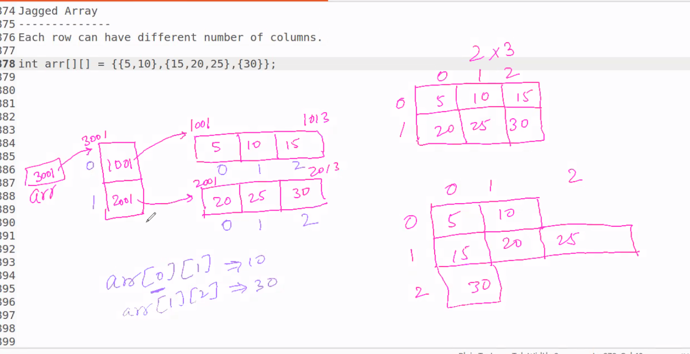
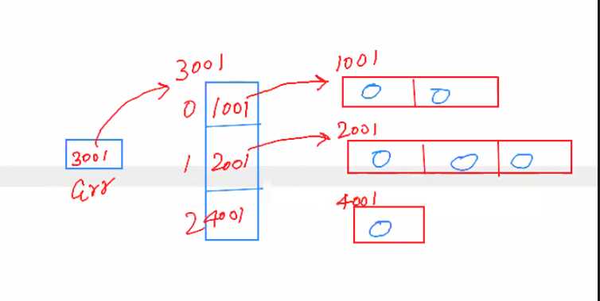
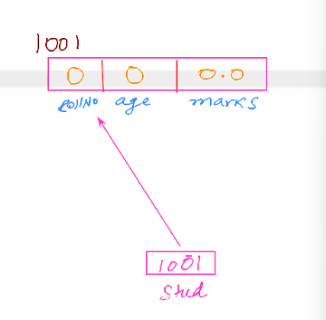
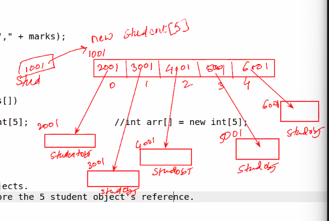

# Array

- it is collection of similar data types
- it quccupies contigous memory

```java
int arr[] = {5,10,15,20,25}; //init with fixed values
```
- above line will create an array and init with 5, 10, 15, 20 values.

- how to access the element => arr[0] => 1st element
                               arr[1] => 2nd element
                    
```java
System.out.println(arr[0]); // 5
```
- now to modify the elements
```java
arr[1] = 8 ; // this line will modify the value inside 2nd element
```
- array index is always starts from 0.

#### How to init array with dyanamic size or at run time

```java
int arr[] = new int[5] ; // init array for 5 integers 
```
- above code will init array for 5 element  with 0 value.

```java
int size = 5; // we can take input from user as well
int arr[] = new int[size]; 
```

#### how to access element of array

```java
int arr[] = {5,10,15,20,25};
for(int i =0 ; i < 5 ; i ++){
    System.out.println(arr[i]);
}
```

#### how dynamic array
```java
//int arr[] = {5,10,15,20,25};
int size = 5;
int arr[] = new int[size] ;
for(int i =0 ; i < size ; i ++){
    System.out.println(arr[i]);  // 0 0 0 0 0 all default values
}
```

```java
int size = 5;
int arr[] = new int[size] ;


// init array with i++ values => 
for(int i =0 ; i < size ; i ++){
    arr[i]  = i; 
}

for(int i =0 ; i < size ; i ++){
    System.out.println(arr[i]); 
}

/*
//output
0
1
2
3
4

*/
```

### *array size:

```java
int arr[] = { 1,2,3,44,4};
int size = arr.length;  // it will give size of array 5
```

### 2D ARRAY

```java
//2d array => array of array
int arr[][]  = { {1,2,3} , {4,5,6} , {7,8,9} };
```
```java
int arr[][]  = { {1,2,3} , {4,5,6} , {7,8,9} };

for(int i = 0 ; i <3 ; i++){
    for(int j =0; j < 3 ; j++){
        System.out.print(arr[i][j]);
    }
    System.out.println();
}
// output
123
456
789
```
- below image is internal representation :


- static allocation => decided at compile time (but all memory is allocated at run time)
- dynamic allocation => decided at run time
- its basically we are giving instructions to JVM in which way to initialize the array


- if size is not known at compile timr
```java
int row = 3;
int col = 3;

int arr[][] = new int[row][col];

for(int i = 0 ; i <row ; i++){
    for(int j =0; j < col ; j++){
       arr[i][j] = j ;
    }
}

for(int i = 0 ; i <row ; i++){
    for(int j =0; j < col ; j++){
        System.out.print(arr[i][j]);
    }
    System.out.println();
}

//output
012
012
012

```

- we can try with different row size and col size
- 
```
int row = 4;
int col = 3;
```
- in this case 4 rows and 3 colunm will be there in array

### Jagged Array

- no of col per row will different
- like this
```
int arr[][] = { {1, 2},
                {12, 24, 36},
                {50} };
```
- how to find out its size
```java

arr[0].length ; // 2
arr[1].length ; // 3
arr[2].length ; // 1
```

```java
int arr[][] = { {1, 2},
                		{12, 24, 36},
                		{50} 			
                		};

        for( int i =0 ; i < 3 ; i++){
        	for(int j =0 ;j < arr[i].length ; j++) // here size of col is variable so we take length of each col
            {
        		System.out.print(arr[i][j] + " ");
        	}
        	System.out.println();
        }

// output:
1 2
12 24 36
50
```
### how to make it dyanamic

```java
int row = 3;
int col ; // varraies

int arr[][] = new int[row][];
```

- now create dyanamic array for col

```
    arr[0] = new int[2];
	 arr[1] = new int[3];
	 arr[2] = new int[1];
```


```java
int arr[][] = new int[row][]; // init rows
	 arr[0] = new int[2];     // init cols with default values
	 arr[1] = new int[3];
	 arr[2] = new int[1];
for(int i = 0 ; i <row ; i++){
    for(int j =0; j < arr[i].length ; j++){
        System.out.print(arr[i][j] + " ");
    }
    System.out.println();
}

// output
0 0
0 0 0
0
```

``` java

int row = 3;
int col ; // varraies

int arr[][] = new int[row][];
	 arr[0] = new int[2];
	 arr[1] = new int[3];
	 arr[2] = new int[1];

	 for(int i = 0 ; i <row ; i++)
     {
    for(int j =0; j < arr[i].length ; j++) 
    {
       arr[i][j] = j + 1 ;  // putting values in each row
    }
}
for(int i = 0 ; i <row ; i++){
    for(int j =0; j < arr[i].length ; j++){
        System.out.print(arr[i][j] + " ");
    }
    System.out.println();
}

// out put
1 2
1 2 3
1
```

## but we didn't take user input for col values


# classes and objects


- class => data + methods
- data: property
- methods - behaviour / functionality

```java
class Student{
    int rollNo;
    int age;
    double marks;
}

public static void main(String[] args){

    new Student();  // creates an obj of Student classs 

}

```
-new Student();  // creates an obj of Student classs 
- // returns the ref of obj => ref of type Student class
 -   // now the data/states of  student class will init to default values
  -  // rollno => 0
   - // age => 0
    - // marks => 0.0

- we need to store that ref

```
Student s1 = new Student();
```
- s1 is reference variable

- but if we only write :
```java
Student std ;
```
- here std if ref var of Student type
- ref doesn't create any object

#### size of reference var is 4 bytes but its depends on JVM specification


```
Student stud = new Student();
```


#### how access the member of class
- member access operator => dot (.)
```java
Student stud;
stud = new Student();

stud.rollNo = 1;
Stud.age = 21;
Stud.marks = 75.88;
```


```java
// to print/access the data member of object
System.out.println( stud.rollNo );
System.out.println( stud.age );
System.out.println( stud.marks );
```

```java
class Student{

	// data 
	int rollNo;
    int age;
    double marks;
}

public class Driver{
	public static void main(String[] args) {
		Student stud;
		stud = new Student();

		// obj get init to default values
		System.out.println( stud.rollNo );  // 0
		System.out.println( stud.age );	    // 0
		System.out.println( stud.marks );   // 0.0

		stud.rollNo = 1;
		stud.age = 21;
		stud.marks = 75.88;

		System.out.println( stud.rollNo );  // 1
		System.out.println( stud.age );	    // 21
		System.out.println( stud.marks );   // 75.88
	}
}
```
### we can init the data member by our own default values
```java
class Student{

	// data 
	int rollNo = 1;
    int age = 23;
    double marks = 223 ;
}

public class Driver{
	public static void main(String[] args) {
		Student stud;
		stud = new Student();

		// obj get init to default values
		System.out.println( stud.rollNo );  // 1
		System.out.println( stud.age );	    // 23
		System.out.println( stud.marks );   // 223.0
    }
}
```

### upto we are init data from outside the class


- create a method to get data
- create a method to print data
- we need ref to call these method
```java
class Student{

	// data 
	int rollNo = 1;
    int age = 23;
    double marks = 223 ;

    //methods
     void getDetails( int r, int a, double m) 
     {
     	rollNo =r;
     	age =a;
     	marks =m;
    }
    void printDetails(){
    	System.out.println( rollNo );  
		System.out.println( age );	    
		System.out.println( marks );   
    }
}

public class Driver{
	public static void main(String[] args) {
		Student stud = new Student();

		stud.getDetails(10, 24, 67.5);
		stud.printDetails();

    }
}
```
#### all objects shear the one copy of method


#### day2

```java
class Cricketer{
    String name;
    String country;
    int totalRun;
    
    void setRun{

    }
    public static void main(String[] args){

        Cricketer c1 = new Cricketer();
        // now what will be size of c1 object
    }
}
```
- so if we create obj of class
-all data member gets space in object + ref
- ref having size => 4 bytes for 32bit
- and 8 bytes , if we have more ram for jvm(greater than 32 gig)
### string
- string is create on heap 
```java
String name = "JHON";
```
- name is only reference of string class points to "JHON" object

### qq

- class 
    - data/property/state
    - method/behaviour/function
    - instance/object/ref

- with (.) dot operator we can access state,behavoiur of obj.
- object size => depends on data and not on method

```java
c1.totalRun = 12;  //acces data member
c1.setRun();   //acces member fun
```

```java
class Student{

	// data 
	int rollNo = 1;
    int age = 23;
    double marks = 223 ;

    //methods
     void setDetails( int r, int a, double m) 
     {
     	rollNo =r;
     	age =a;
     	marks =m;
    }
    void printDetails(){
    	System.out.println( rollNo );  
		System.out.println( age );	    
		System.out.println( marks );   
    }
}

public class Driver{
	public static void main(String[] args) {
		Student stud1 = new Student();
        Student stud2 = new Student();

		stud1.setDetails(10, 24, 67.5);
        stud2.setDetails(11, 23, 55.4);


		stud1.printDetails();
        stud2.printDetails();
    }
}
```
- consider above code
- when we create "stud1" => 
                        - data will get store inside the stud1.
- when we say "stud1.setDetails(10, 24, 67.5);"
                        - 10,24,67.5 will get assign to rollNO ,age, marks of "stud1" .

- every obj initlize the data individually
- 

#### Constructor
- special member function of class 
- name similar to class name

```java
class Student{
    //data
    int rollNum;
    int age;
    double marks;

    Student(){ // zero-argument ctor

    }
    Student(int r, int a, double m){ //three-args ctor
                // here r, a, m => local var
                // will get distroy when method get distroy
    }

    //methods
}
```

- use of ctor to init the values of data member of object 

```java

Student stud1 = new Student();  // zero-args ctor

Student stud2 = new Student(12,23,45.4); // parameterise ctor
 ```

- internally jvm provides default ctor for per class
- but when we write our owm ctor, then jvm use user define ctor , and doesn't  provide its default ctor.

### constructor chaining
### method overloading
### why ctor has no retrun type
### This keyword

- 'this' is ref to current object.
- current obj is the obj which has currently active and made the fun call
```java
class{
    //code
    void printdata(){  // this method will get this
        this.rollNum;    // current obj data
    }
    main{
        Student s1 = new Student();
        Student s2 = new Student();

        s1.printdata(); // current obj=> s1;  => this === s1
        s2.printdata(); // current obj=> s2;  => this === s2
    }
}
```


- ex
```java
class Student{
    
    // instance variable // part of obj
    int rollNum;
    int age;
    double marks;

    Student(){ 
        rollNum = 0;
        age  = 18 ;
        marks = 35 ;

    }
    Student(int rollNum, int age, double marks){ //three-args ctor
               this.rollNum = rollNum;
               this.age = age;
               this.marks = marks 
                
    }

    void calculateMarks(double marks){
        int multiplier = 2;  // local var  // not a part of obj

        this.marks = marks*multipier;
    }
    void printData(){
        System.out.println(this.rollNum);  // this  => s1.rollNum || s2.rollNum
        System.out.println(this.age);
        System.out.println(this.marks);
    }

    main(){
        Student s1 = new Student(12, 22 , 87.34);
        Student s2 = new Student(11 , 22 , 67.00);

        s1.printData();
        s2.printData();

    }

    //methods
}
```

- variable shadowing  => when local var get preference
- ~~~~~~~~~~~~~~~~~~~~~~~~~~~~~~~~
- this - use in ctor chaining
- we can call one ctor from another ctor using 'this()' 
- if we call ctor using 'this()' it should always be the first statement in ctor

```java
class Student{
    int roll;
    double marks;
    String std ;
    int stdTD;

    Student(){
        this.std = "A";
    }
    Student(int roll){  //
        this() ;         // ctor calling mustbe first statement
        this.roll = roll ;
    }
    Student(int roll, double marks){
        this(roll);  // called one parameter ctor
        this.marks = marks;
    }

    Student(int roll , double marks, int stdTD{
        this(roll, double);
        this.stdID =  stdTD;
    }

    void printData(){

        System.out.println(this.roll);  
        System.out.println(this.marks);
        System.out.println(this.std);

    }


}
class CtorDemo{
    public static void main(Strign args[]){

        Student s1 = new Student(1,56.6);

        Student s2  = new Student(9, 77.7 , 9897976);  // new data 

        s1.printData();
        s2.printData(); // 9 77.7 

        new student(12, 98.66 , 456456).printData(); // OK
    }
}
```

- we can call another method for obj from other method
```java

void showInfo(){
    sysout(this.name);
    sysout(this.grade);
    printdata();
}
void printdata(){ //  same ref will get here
    sysout(this.ID);
    sysout(this.marks);
}
```
- or we call any overrloaded method
```java
void showInfo(){
    sysout(this.name);
    sysout(this.grade);
    printdata();
}
void showInfo(int a){ 
    this.showInfo(); // fun call
    sysout(this.a);
}
```

- but ctor calling from any method will get error

```java
void myfun(){
    this(); // ctor calling from inside of method // not ok
}
```

#### Array of Objects

```java
class Student{
    int roll;
    double marks;

    Student(int roll, double marks){
        this.roll = roll;
        this.marks = marks;
    }
    void printData(){
        System.out.println(this.roll);
        System.out.println(this.marks);
    }

}
class Driver{
    public static void main(String args[]){
        Student s1 = new Student(12 , 34.4);
        s1.printData();
        
        Student s2 = new Student(); // error: constructor Student in class Student cannot be applied to given types;
        s2.printData();

    }
}
```

- Java says<br/>
            - if you dont give any ctor , it will provide one for you (defaul one).<br/>
            - but if you define your own ctor then will not give default ctor.<br/>
            - it will be programmers resiponsibility  to write default ctor.<br/>

### Array of obbjects start
```java
Student arr[] = new Student[5];
```
- new Student[5]; => it is not creating 5 student obj
- it is creating array of 5 references of Student type
- it will create array of ref
- below imag is array ref but initially it stores null

```
Student arr[] = new Student[5];
```


```java
main{
    Student s1 = new Student[5];
    s1[0].printData(); // NULLPointerException
    // Exception in thread "main" java.lang.NullPointerException: Cannot invoke "Student.printData()" because "<local2>[0]" is null
}
```

```java
main{
    Student s1 = new Student[5];
    s1[0] = new Student(1 , 65.5); // we init s1[0]
    s1[0].printData();  // now ok
    
}
```
- we can init all ref by using loop
```java

class Student{
    int roll;
    double marks;
Student(){
	this.roll = 12;
	this.marks = 99.9;
}
    Student(int roll, double marks){
        this.roll = roll;
        this.marks = marks;
    }
    void printData(){
        System.out.println(this.roll);
        System.out.println(this.marks);
    }

}
public class ClassA{
    public static void main(String args[]){
        
        Student s2[] = new Student[5];
        
        // init all obj
        for( int i =0 ; i < 5; i++){
        	s2[i] = new Student(i+1, 75.75);
        }

        // printing all obj
        for(int i =0 ; i<5; i++){
        	s2[i].printData();
        }
    }
}
// output
1
75.75
2
75.75
3
75.75
4
75.75
5
75.75


```